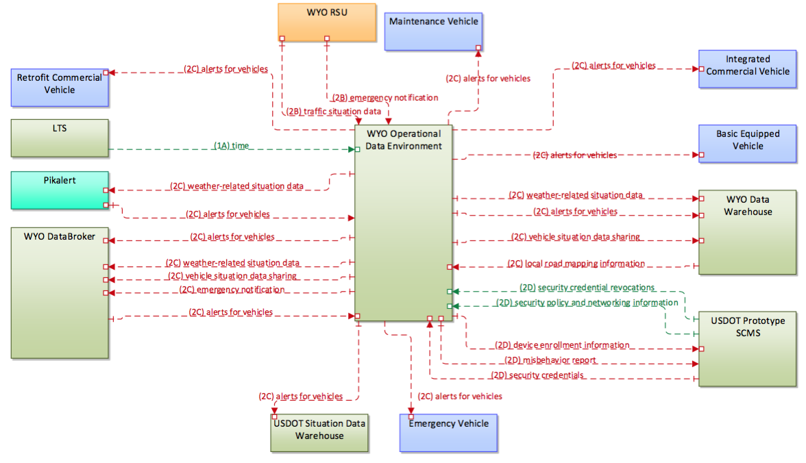

Master: [](https://travis-ci.org/usdot-jpo-ode/jpo-ode) [](https://sonarqube.com/dashboard/index?id=us.dot.its.jpo.ode%3Ajpo-ode)

Develop: [](https://travis-ci.org/usdot-jpo-ode/jpo-ode) [](https://sonarqube.com/dashboard/index?id=us.dot.its.jpo.ode%3Ajpo-ode%3Adevelop)

# jpo-ode
US Department of Transportation Joint Program office (JPO) Operational Data Environment (ODE)



## Project Description
In the context of ITS, an Operational Data Environment is a real-time data acquisition and distribution software system that processes and routes data from Connected-X devices –including connected vehicles (CV), personal mobile devices, and infrastructure components and sensors –to subscribing applications to support the operation, maintenance, and use of the transportation system, as well as related research and development efforts.

This project is currently working with the Wyoming Department of Transportation (WYDOT) as one of the Connected Vehicle (CV) Pilot sites
to showcase the value of and spur the adoption of CV Technology in the United States.

As one of the three selected pilots, WYDOT is focusing on improving safety and mobility by creating new ways to communicate road and travel information to commercial truck drivers and fleet managers along the 402 miles of Interstate 80 (I-80 henceforth) in the State. For the pilot project, WYDOT will work in a planning phase through September 2016. The deployment process will happen in the second phase (ending in September 2017) followed by an 18-month demonstration period in the third phase (starting in October 2017).

## Project Goals
The current project goals for the ODE have been developed specifically for the use case of WYDOT. Additional capabilities and system functions are planned for later releases.

- **Collect CV Data:** Connected vehicle data from field may be collected from vehicle OBUs directly or through RSUs. Data collected include Basic Safety Messages Part I and Part 2, Event Logs and other probe data (weather sensors, etc.). These messages are ingested into the operational data environment (ODE) where the data is then further channeled to other subsystems.
- **Support Data Brokerage:** The WYDOT Data Broker is a sub-system that is responsible for interfacing with various WYDOT Transportation Management Center (TMC) systems gathering information on current traffic conditions, incidents, construction, operator actions and road conditions. The data broker then distributes information from PikAlert, the ODE and the WYDOT
interfaces based on business rules. The data broker develops a traveler information message (TIM) for segments on I-80, and provide event or condition information back to the WYDOT interfaces
- **Distribute traveler information messages (TIM):** The data broker distributes the TIM message to the operational data environment (ODE) which will then communicate the message back to the OBUs, RSUs and the situational data warehouse (SDW)
- **Store data:** Data generated by the system (both from the field and the back-office sub-systems)
are stored in the WYDOT data warehouse.


 
## Release Notes
### Release 1.0

## Collaboration Tools

### Source Repositories - GitHub
- Main repository on GitHub (public)
	- https://github.com/usdot-jpo-ode/jpo-ode
	- git@github.com:usdot-jpo-ode/jpo-ode.git
- Private repository on BitBucket
	- https://usdot-jpo-ode@bitbucket.org/usdot-jpo-ode/jpo-ode-private.git
	- git@bitbucket.org:usdot-jpo-ode/jpo-ode-private.git

### Agile Project Management - Jira
https://usdotjpoode.atlassian.net/secure/Dashboard.jspa

### Wiki - Confluence
https://usdotjpoode.atlassian.net/wiki/

### Continuous Integration and Delivery
https://travis-ci.org/usdot-jpo-ode/jpo-ode

To allow Travis run your build when you push your changes to your public fork of the jpo-ode repository, you must define the following secure environment variable using Travis CLI (https://github.com/travis-ci/travis.rb). 

Run:

```
travis login --org
```
Enter personal github account credentials and then run this:

```
travis env set PRIVATE_REPO_URL_UN_PW 'https://<bitbucketusername>:<password>@bitbucket.org/usdot-jpo-ode/jpo-ode-private.git' -r <travis username>/jpo-ode
```

The login information will be saved and this needs to be done only once.

### Static Code Analysis
https://sonarqube.com/dashboard/index?id=us.dot.its.jpo.ode%3Ajpo-ode%3Adevelop

## Getting Started

### Local Build

#### Prerequisites
* Maven: https://maven.apache.org/install.html
* Git: https://git-scm.com/

#### Instructions

The following instructions describe the procedure to fetch, build and run the application.

##### Getting the source Code
Clone the source code from GitHub and BitBucket repositories using Git commands:

```
git clone https://github.com/usdot-jpo-ode/jpo-ode.git
git clone https://usdot-jpo-ode@bitbucket.org/usdot-jpo-ode/jpo-ode-private.git
```

##### Building the Executables

To build the application use maven command line. 

**Step 1**. Navigate to the root directory of the jpo-ode-private project:

```
 cd jpo-ode-private/
 mvn clean
 mvn install
```
It is important you run mvn clean first and then mvn install because mvn clean installs the required OSS jar file in you rmaven local repository. 

**Step 2**. Navigate to the root directory of the jpo-ode project:

```
 cd jpo-ode (or cd ../jpo-ode if you are in the jpo-ode-private directory) 
 mvn clean install
```
##### Running the application
To run the application, from jpo-ode directory: 

```
java -jar jpo-ode-svcs/target/po-ode-svcs-0.0.1-SNAPSHOT.jar
```

You should be able to access the running service at `localhost:8080`.

```json
{
	"coreData": {
		"position":	{
				"latitude":42.3288028,
				"longitude":-83.048916,
				"elevation":157.5
		}
	}
}
```

And the output:

```
004C4C8CCD00005AD2749535A4E8D6084E80000000000500007E7D07D07F7FFF0000050050000000000000000000000000000000000000000000000000000000

{"coreData":{"msgCnt":1,"id":"31323334","secMark":1,"position":{"latitude":0.0000042,"longitude":-0.0000083,"elevation":15.7},"accelSet":{"accelLat":0.00,"accelLong":0.00,"accelVert":0.00,"accelYaw":0.00},"accuracy":{"semiMajor":0.00,"semiMinor":0.00,"orientation":0.0},"transmission":"neutral","speed":0.20,"heading":0.0000,"angle":0.0,"brakes":{"wheelBrakes":{"BIT STRING":false},"traction":"unavailable","abs":"unavailable","scs":"unavailable","brakeBoost":"unavailable","auxBrakes":"unavailable"},"size":{"width":10,"length":10}},"partII":[]}
```

Which demonstrates a loop of Readable JSON -> ASN.1 UPER encoded BSM Message -> Readable Output


### Integrated Development Environment (IDE)

Install the IDE of your choice:

* Eclipse: [https://eclipse.org/](https://eclipse.org/)
* STS: [https://spring.io/tools/sts/all](https://spring.io/tools/sts/all)
* IntelliJ: [https://www.jetbrains.com/idea/](https://www.jetbrains.com/idea/)


### Continuous Integration and Delivery

### Deployment

## Docker
docker/README.md
