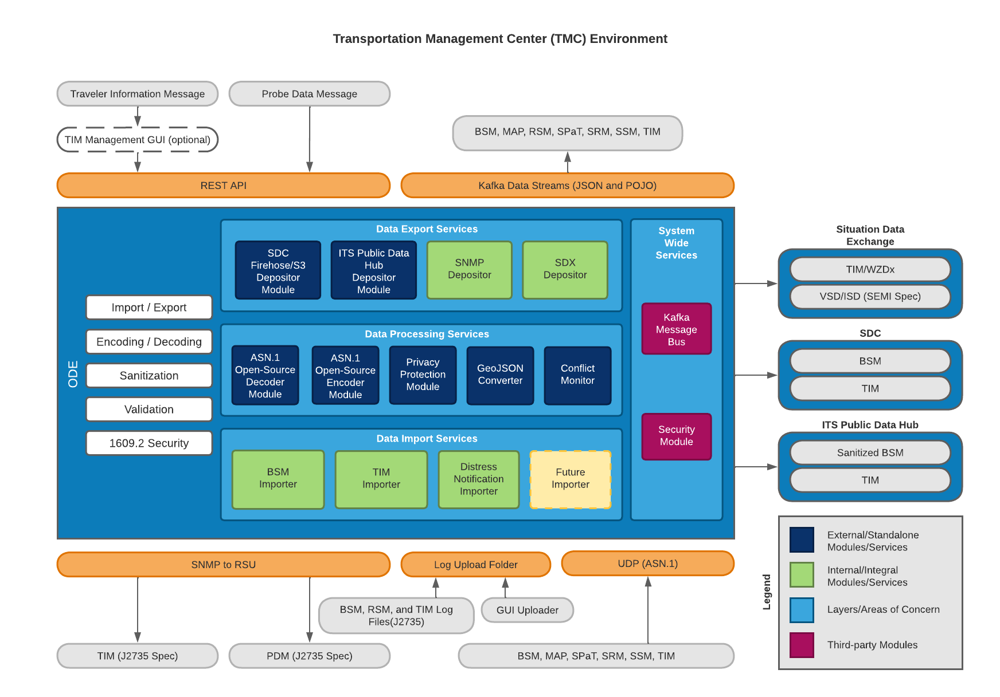
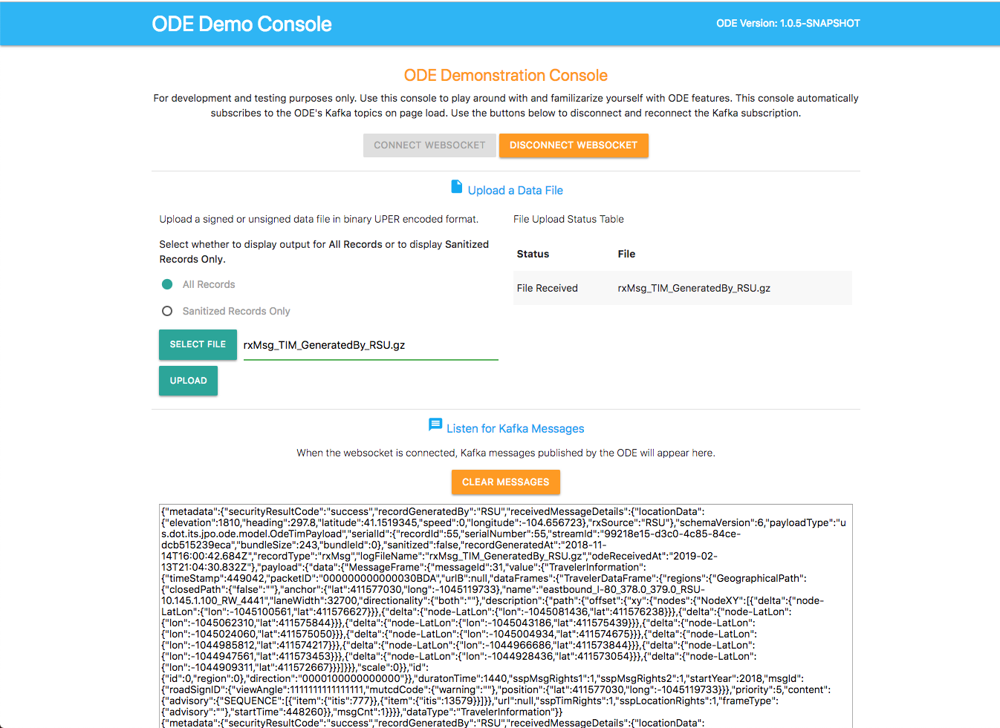
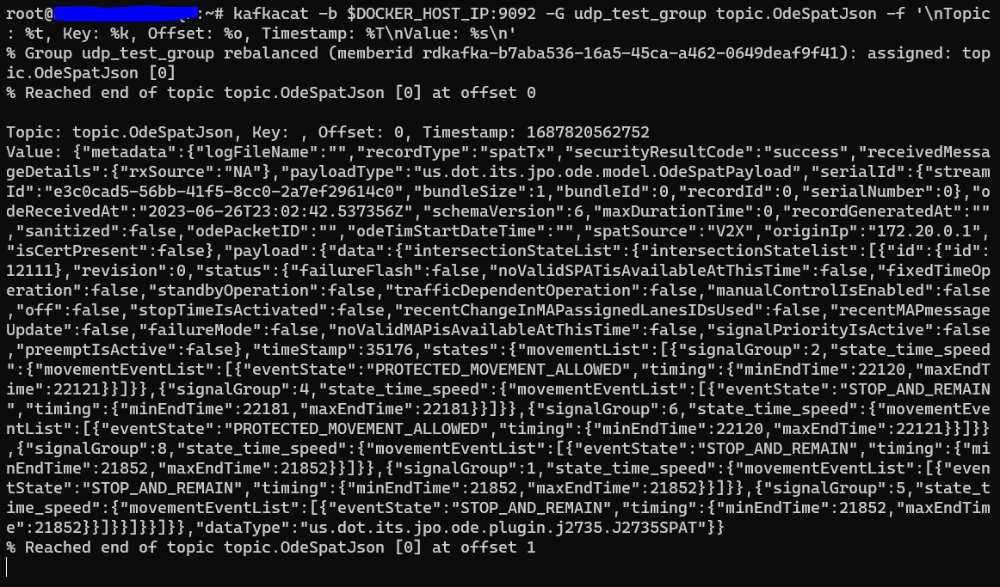

| Sonar Code Quality | Sonar Code Coverage |
|---------------------|---------------------|
[](https://sonarcloud.io/dashboard?id=usdot.jpo.ode%3Ajpo-ode) | [](https://sonarcloud.io/dashboard?id=usdot.jpo.ode%3Ajpo-ode) |

# jpo-ode

**US Department of Transportation (USDOT) Intelligent Transportation Systems (ITS) Joint Program Office (JPO) Operational Data Environment (ODE)**

The ITS ODE is a real-time virtual data router that ingests and processes operational data from various connected devices - including vehicles, infrastructure, and traffic management centers - and distributes it to other devices and subscribing transportation management applications. Using the ITS ODE within intelligent transportation deployments increases data fluidity and interoperability while meeting operational needs and protecting user privacy. The software’s microservices architecture makes it easy to add new capabilities to meet local needs. Check the ITS factsheet for more information: <https://www.its.dot.gov/factsheets/pdf/ITSJPO_ODE.pdf>.



_Figure 1: ODE Dataflows_

**Documentation:**

1. [ODE Architecture](docs/Architecture.md)
1. [ODE User Guide](docs/UserGuide.md)
1. [ODE Output Schema Reference Guide](docs/ODE_Output_Schema_Reference.docx)
1. [ODE REST API Guide](https://usdot-jpo-ode.github.io/)
1. [ODE Smoke Tests](https://github.com/usdot-jpo-ode/jpo-ode/wiki/JPO-ODE-QA-Documents)

All stakeholders are invited to provide input to these documents. To provide feedback, we recommend that you create an "issue" in this repository (<https://github.com/usdot-jpo-ode/jpo-ode/issues>). You will need a GitHub account to create an issue. If you don’t have an account, a dialog will be presented to you to create one at no cost.

---

<a name="toc"></a>

**Release Notes**

The current version and release history of the JPO-ODE: [ODE Release Notes](<docs/Release_notes.md>)

## Table of Contents

1. [Usage Example](#1-usage-example)
1. [Configuration](#2-configuration)
1. [Installation](#3-installation)
1. [File Manifest](#4-file-manifest)
1. [Development Setup](#5-development-setup)
1. [Release History](#6-release-history)
1. [Contact Information](#7-contact-information)
1. [Contributing](#8-contributing)
1. [Credits and Acknowledgement](#9-credits-and-acknowledgement)
1. [Code.gov Registration Info](#10-codegov-registration-info)
1. [Kubernetes](#11-kubernetes)
1. [Sonar Cloud](#12-sonar-token-configuration) ([Documentation](https://sonarcloud.io/documentation/user-guide/user-token/))
1. [SNMP](#13-snmp)
1. [GitHub Artifact Usage](#14-gitHub-artifact-usage)

<!--
#########################################
############# Usage Example #############
#########################################
 -->

<a name="usage-example"></a>

## 1. Usage Example

Once the ODE is deployed and running locally, you may access the ODE's demonstration console by opening your browser and navigating to  `http://localhost:8080`. This portal can only be used to decode a subset of the supported message types: BSM and TIM messages. To decode messages such as MAP, SPaT, SRM and SSM, the ODE UDP ports must be utilized. The following sections will describe how to utilize both methods.

<b>For testing BSM and TIM decoding only:</b>
1.  Press the `Connect` button to connect to the ODE WebSocket service.
2.  Press `Select File` button to select an OBU log file containing BSMs and/or TIM messages as specified by the WYDOT CV Pilot project. See below documents for details:
    - [Wyoming CV Pilot Log File Design](data/Wyoming_CV_Pilot_Log_File_Design.docx)
    - [WYDOT Log Records](data/wydotLogRecords.h)
3.  Press `Upload` button to upload the file to ODE.

Upload records within the files can be embedding BSM, MAP and/or TIM messages wrapped in J2735 MessageFrame and ASN.1 UPER encoded, wrapped in IEEE 1609.2 envelope and ASN.1 COER encoded binary format. Log processing of files that contain messages with WSMP headers within the ASN.1 UPER encoded messages is supported but the header will be removed before processing. Please review the files in the [data](data) folder for samples of each supported type. By uploading a valid data file, you will be able to observe the decoded messages contained within the file appear in the web UI page while connected to the WebSocket interface.

Another way data can be uploaded to the ODE is through copying the file to the location specified by the `ode.uploadLocationRoot/ode.uploadLocationObuLog`property. If not specified,  Default locations would be `uploads/bsmlog`sub-directory off of the location where ODE is launched. In a standard Docker deployment, it is recommended to attach a storage directory from the machine that the ODE launched on as a volume. This way OBUs can log offload to a standard machine and the machine can handle the authorized_keys for SSH connections. This is how this repository's docker-compose is setup with using the uploads directory as the mounted volume. In a Kubernetes deployment this is not possible, so the ODE has been equipped with an SSH server of its own that can be exposed through port 22. The authorized_keys can be attached as a volume and it is recommended to attach some form of NFS persistent volume as a substitute for the pod's '/home/uploads/backup' directory. (See the [Kubernetes documentation](/docs/k8s-demo/templates/jpoode_ode.yaml) on an example on how to do this) However, it is not recommended to use this SSH server in a local Docker environment and thereby the port 22 will be disabled by default.

The result of uploading and decoding of messages will be displayed on the UI screen.



_Figure 2: ODE UI demonstrating message subscription_

Notice that the empty fields in the J2735 message are represented by a `null` value. Also note that ODE output strips the MessageFrame header and returns a pure BSM or TIM in the subscription topic.

With the PPM module running, all filtered BSMs that are uploaded through the web interface will be captured and processed. You will see an output of both submitted BSM and processed data unless the entire record was filtered out.

<b>For testing decoding with all supported ODE message types:</b>

To test decoding all supported ODE messages, the UDP endpoints must be utilized. These endpoints specifically take hex ASN.1 UPER encoded message data. These messages are allowed to have headers but do not need to. The headers are trimmed out currently once the UDP receiver receives the message so this data will not affect the output.

Supported message types:
- BSM
- TIM
- MAP
- SPaT
- SRM
- SSM
- PSM

1. Navigate to the [UDP sender Python scripts](<./scripts/tests/>) in the project.
2. Ensure the environment variable "DOCKER_HOST_IP" has been set in the shell that will be running the script. This must be set to the same IP that the ODE deployments are using.
3. Run the script of your choosing: `python3 ./scripts/tests/udpsender_spat.py`
4. View the output Kafka messages from kafkacat: `kafkacat -b $DOCKER_HOST_IP:9092 -G udp_test_group topic.OdeSpatJson -f '\nTopic: %t, Key: %k, Offset: %o, Timestamp: %T\nValue: %s\n'`
5. The script should continue to send the same message every 5 seconds and kafkacat should continue to output the latest message.
6. You may modify the content of the UDP sender scripts to test different payloads of your own.

<p align="center">
  
</p>

[Back to top](#table-of-contents)


<!--
#########################################
############# Configuration #############
#########################################
 -->

<a name="configuration"></a>

## 2. Configuration

### System Requirements

-  Minimum RAM: 16 GB
-  Minimum storage space: 100 GB
-  Supported operating systems:
   -  Ubuntu 22.04 Linux (Recommended)
   -  Windows 10/11 Professional (Professional version required for Docker virtualization)
   -  OSX 13

The ODE software can run on most standard Windows, Mac, or Linux based computers with
Pentium core processors. Performance of the software will be based on the computing power and available RAM in
the system.  Larger data flows can require much larger space requirements depending on the
amount of data being processed by the software. The ODE software application was developed using the open source programming language Java. If running the ODE outside of Docker, the application requires the Java 21 runtime environment.

### Software Prerequisites

The ODE is bundled as a series of submodules running in Docker containers and managed by Docker-Compose. All other required dependencies will automatically be downloaded and installed as part of the Docker build process.

- Docker: <https://docs.docker.com/engine/installation/>
- Docker-Compose: <https://docs.docker.com/compose/install/>
  - NOTE: Requires version 2.20 or newer
- Make: <https://www.gnu.org/software/make/>
  - Windows install with Choco: `choco install make`
    - Windows install Choco: <https://chocolatey.org/install>
  - Ubuntu install with apt: `sudo apt install make`

### Tips and Advice

Read the following guides to familiarize yourself with ODE's Docker and Kafka modules.

- [Docker README](docker.md)
- [Kafka README](kafka.md)

The following guide contains information about the data flow diagrams for the ODE.

- [Data Flow Diagrams README](docs/data-flow-diagrams/README.md)

**Installation and Deployment:**

- Docker builds may fail if you are on a corporate network due to DNS resolution errors.
[See here](https://github.com/usdot-jpo-ode/jpo-ode/wiki/Docker-fix-for-SSL-issues-due-to-corporate-network) for instructions to fix this.
- Additionally `git` commands may fail for similar reasons, you can fix this by running `export GIT_SSL_NO_VERIFY=1`.
- Windows users may find more information on installing and using Docker [here](https://github.com/usdot-jpo-ode/jpo-ode/wiki/Docker-management).
- A compatibility guide containing recommendations for suitable versions of submodules for each main module version can be found [here](docs/compatibility.md).

**Configuration:**

If you wish to change the application properties, such as change the location of the upload service via `ode.uploadLocation.*` 
properties or set the `ode.kafkaBrokers` to something other than the `$DOCKER_HOST_IP:9092`, or wish to change the log 
file upload folder, etc. instead of setting the environment variables, modify `jpo-ode-svcs\src\main\resources\application.yaml` file as desired.
To adjust the settings in your unit/integration tests, modify the `jpo-ode-svcs\src\test\resources\application.yaml` file.

ODE configuration can be customized for every deployment environment using environment variables. These variables can either be set locally or using the [sample.env](sample.env) file. Instructions for how to use this file can be found [here](https://github.com/usdot-jpo-ode/jpo-ode/wiki/Using-the-.env-configuration-file).

**Important!**

You must rename `sample.env` to `.env` for Docker to automatically read the file. This file will contain AWS access keys and other private information. Do not push this file to source control.

[Back to top](#table-of-contents)


<!--
########################################
############# Installation #############
########################################
 -->

<a name="installation"></a>

## 3. Installation

The following instructions describe the minimal procedure to fetch, build, and run the main ODE application. If you want to use the privacy protection module and/or S3 depositors, see the [User Guide](docs/UserGuide.md) for more detailed information. Additionally, different build processes are covered at the bottom of this section.

#### Step 0 - For Windows Users Only

If running on Windows, please make sure that your global git config is set up to not convert end-of-line characters during checkout.

Disable `git core.autocrlf` (One Time Only)

```bash
git config --global core.autocrlf false
```

#### Step 1 - Download the Source Code

The ODE software system consists of the following modules hosted in separate Github repositories:

|Name|Visibility|Description|
|----|----------|-----------|
|[jpo-ode](https://github.com/usdot-jpo-ode/jpo-ode)|public|Contains the public components of the application code.|
|[jpo-cvdp](https://github.com/usdot-jpo-ode/jpo-cvdp)|public|Privacy Protection Module|
|[asn1_codec](https://github.com/usdot-jpo-ode/asn1_codec)|public|ASN.1 Encoder/Decoder module|
|[jpo-security-svcs](https://github.com/usdot-jpo-ode/jpo-security-svcs)|public|Provides cryptographic services.|
|[jpo-sdw-depositor](https://github.com/usdot-jpo-ode/jpo-sdw-depositor)|public|SDW depositor service. Optional, can be enabled by using the `COMPOSE_PROFILES` environmental variable|

You may download the stable, default branch for ALL of these dependencies by using the following recursive git clone command:

```bash
git clone --recurse-submodules https://github.com/usdot-jpo-ode/jpo-ode.git
```

If you have already cloned the repository, you can use the following command to download the stable, default branch for all dependencies by using the following command:

```bash
git submodule update --init --recursive
```

Once you have these repositories obtained, you are ready to build and deploy the application.

##### Downloading the source code from a non-default branch

<details><summary>(Advanced) Downloading the source code from a non-default branch</summary>
<p>

The above steps to pull the code from GitHub repository pulls it from the default branch which is the stable branch. If you wish to pull the source code from a branch that is still under development or beta testing, you will need to specify the branch to pull from. The following commands aid you in that action.

**Note**: These commands can also be performed using the provided script `update_branch`.

```bash
# Backup user provided source or configuration files used by submodules
cp asn1_codec/asn1c_combined/J2735_201603DA.ASN .

# Run the following commands to reset existing branch
git reset --hard
git submodule foreach --recursive git reset --hard

# Pull from the non-default branch
git checkout <branch_name>
git pull origin <branch_name>

# The next command wipes out all of the submodules and re-initializes them.
git submodule deinit -f . && git submodule update --recursive --init

# Restore user provided source or configuration files used by submodules
cp ./J2735_201603DA.ASN asn1_codec/asn1c_combined/
```

</p>
</details>

<details><summary>(Advanced) Removing an old submodule reference</summary>
<p>

The following commands help with removing an old submodule reference. The following refers to the removal of the jpo-s3-deposit submodule however the logic can be used for other Git submodules as well.

```bash
# Remove references to the git submodule
git submodule deinit -f jpo-s3-deposit
rm -rf .git/modules/jpo-s3-deposit
rm -rf jpo-s3-deposit
git rm --cached jpo-s3-deposit

# Run the following commands to reset existing branch
git reset --hard
git submodule foreach --recursive git reset --hard

# The next command wipes out all of the submodules and re-initializes them.
git submodule deinit -f . && git submodule update --recursive --init
```

</p>
</details>

#### Step 2 - Build and run the application

**Notes:**

- Docker builds may fail if you are on a corporate network due to DNS resolution errors.
[See here](https://github.com/usdot-jpo-ode/jpo-ode/wiki/Docker-fix-for-SSL-issues-due-to-corporate-network) for instructions to fix this.
- In order for Docker to automatically read the environment variable files, you must:
  - Make a copy of [sample.env](./sample.env) rename it as `.env` **_and_**;
  - Make a copy of [jpo-utils/sample.env](jpo-utils/sample.env), rename it as `.env` (keep this one in the `jpo-utils/` directory), and fill in the variables as described in the [jpo-utils README](jpo-utils/README.md)
  - **The .env files will contain private keys, do not add them to version control.**
  - Log-based alerts are enabled by default in the `sample.env`. If you don't want log messages notifying you when no TIMs were ingested in a specific period of time, 
  you will want to update your `.env` file to set `ODE_TIM_INGEST_MONITORING_ENABLED=false`. See [TimIngestWatcher](jpo-ode-svcs/src/main/java/us/dot/its/jpo/ode/traveler/TimIngestWatcher.java) to see the log-based monitoring provided.

**Make:**

Navigate to the root directory of the jpo-ode project and run the following command:

```bash
# View available options:
$ make
Make target options:
`make start` to run the ODE
`make build` to build the ODE
`make stop` to stop the ODE
`make delete` to stop the ODE and remove the volumes
`make restart` to restart the ODE
`make rebuild` to stop, delete, and then rebuild the containers
`make clean-build` to rebuild the containers without using the cache
```

Possible error messages if `.env` files are not created:

```bash
# jpo-ode .env is missing
$ make start
Makefile:11: *** "ERROR: jpo-ode Environment file `.env` not found in ".  Stop.

# jpo-utils .env is missing
$ make start
Makefile:14: *** "ERROR: jpo-utils Environment file `.env` not found in ".  Stop.
```

**Docker Compose:**

Navigate to the root directory of the jpo-ode project and run:

```bash
make start
```

OR

```bash
docker compose up --build -d
docker compose ps
```

To bring down the services and remove the running containers run:

```bash
make stop
```

OR

```bash
docker compose down
```

For a fresh restart, run:

```bash
make rebuild
```

OR

```bash
docker compose down
docker compose up --build -d
docker compose ps
```

To completely rebuild from scratch, run:

```bash
make rebuild
```

OR

```bash
docker compose down
docker compose rm -v
docker compose up --build -d
docker compose ps
```

Check the deployment by running `docker compose ps`. You can start and stop containers using `docker compose start` and `docker compose stop` commands.
If using the multi-broker docker compose file, you can change the scaling by running `docker compose scale <container>=n` where container is the container you would like to scale and n is the number of instances. For example, `docker compose scale kafka=3`.

To configure what services are started, use the `COMPOSE_PROFILE` environmental variable and set a comma separated string of profiles you want to start up. This project also supports all `COMPOSE_PROFILE` values implemented in the [jpo-utils](jpo-utils/README.md) `docker-compose.yml`. The following are the available profiles that the ODE is currently configured to use along with the services they will enable:

- Profile name: `ode_base`
  - Services: `ode, adm, and aem`
- Profile name: `ode_full`
  - Services: `ode, adm, aem, ppm_bsm, sdw_depositor, and sec`

Profiles are also available for each service name to individually specify a service to enable.

#### asn1_codec Module (ASN.1 Encoder and Decoder)

ODE requires the deployment of asn1_codec module. ODE's `docker-compose.yml` file is set up to build and deploy the module in a Docker container. If you wish to run `asn1_codec` module outside Docker (i.e. directly on the host machine), please refer to the documentation of `asn1_codec` module.

The only requirement for deploying `asn1_codec` module on Docker is the setup of two environment variables `DOCKER_HOST_IP` and `DOCKER_SHARED_VOLUME`.

#### PPM Module (Geofencing and Filtering)

To run the ODE with PPM module, you must install and start the PPM service. PPM service communicates with other services through Kafka Topics. PPM will read from the specified "Raw BSM" topic and publish the result to the specified "Filtered Bsm" topic. These topic names are specified by the following ODE and PPM properties:

[//]: # (&#40;TODO&#40;@mcook42&#41;: Once the application.yaml file is updated with the correct properties at the end of the OdeProperties refactor effort, update the following list with the correct instructions&#41;)
 - ODE properties for communications with PPM (set in application.yaml)
	 - ode.kafkaTopicOdeBsmJson  (default = topic.OdeBsmJson)
	 - ode.kafkaTopicFilteredOdeBsmJson (default = topic.FilteredOdeBsmJson)
 - PPM properties for communications with ODE (set in yourconfig.properties)
	 - privacy.topic.consumer (default = j2735BsmRawJson)
	 - privacy.topic.producer (default = j2735BsmFilteredJson)

Follow the instructions [here](https://github.com/usdot-jpo-ode/jpo-cvdp/blob/master/docs/installation.md) to install and build the PPM service.

During the build process, edit the sample config file located in `config/example.properties` and point the property `metadata.broker.list` towards the host of your docker machine or wherever the kafka brokers are hosted. You may use the command `docker-machine ls` to find the kafka service.

After a successful build, use the following commands to configure and run the PPM

```bash
cd $BASE_PPM_DIR/jpo-cvdp/build
$ ./bsmjson_privacy -c ../config/ppm.properties
```

### Confluent Cloud Integration

Rather than using a local kafka instance, the ODE can utilize an instance of kafka hosted by Confluent Cloud via SASL.

#### Environment variables

##### Purpose & Usage

- The DOCKER_HOST_IP environment variable is used to communicate with the bootstrap server that the instance of Kafka is running on.

- The KAFKA_TYPE environment variable specifies what type of kafka connection will be attempted and is used to check if Confluent should be utilized. If this environment variable is not set, the ODE will default to normal behavior.

- The CONFLUENT_KEY and CONFLUENT_SECRET environment variables are used to authenticate with the bootstrap server. If the KAFKA_TYPE environment variable is not set, then these are not required.

##### Values

In order to utilize Confluent Cloud:

- DOCKER_HOST_IP must be set to the bootstrap server address (excluding the port)

- KAFKA_TYPE must be set to "CONFLUENT"

- CONFLUENT_KEY must be set to the API key being utilized for CC

- CONFLUENT_SECRET must be set to the API secret being utilized for CC

#### Note

This has only been tested with Confluent Cloud but technically all SASL authenticated Kafka brokers can be reached using this method.

[Back to top](#table-of-contents)

# MongoDB Integration

## Description and Configuration

To sink streamed kafka topic data to a MongoDB database, a kafka connect and MongoDB instance can be deployed for the ODE. To deploy the kafka connect and MongoDB instance, add the following profiles to your `COMPOSE_PROFILES` env variable: `ode_base,kafka_connect_standalone,kafka_setup`. This will result in the following topics being synced to MongoDB:

- OdeBsmJson
- OdeMapJson
- OdeSpatJson
- OdeTimJson
- OdePsmJson

The configuration that defines this is in the jpo-utils submodule [here](jpo-utils\kafka-connect\connect_start.sh). This script is attached to the `connect` container as a volume and if you would like to sink different topics then feel free to make a copy of the `connect_start.sh` script and attach it to the `connect` container to the following path: `/scripts/connect_start.sh`. The script can be overridden by setting the `CONNECT_SCRIPT_RELATIVE_PATH` to a location relative to the `/jpo-utils` repository.

For further documentation on configuring the MongoDB Kafka Connect image refer [to this readme](jpo-utils/README.md).

## Note

Kafka connect is being used for MongoDB in this implementation but it can interact with many types of databases, here is further documentation for [kafka connect](https://docs.confluent.io/platform/current/connect/index.html)

[Back to top](#table-of-contents)

<!--
#########################################
############# File Manifest #############
#########################################
 -->

<a name="file-manifest"></a>

## 4. File Manifest

This section outlines the software technology stacks of the ODE.

### Containerization and Management

- [Docker](https://www.docker.com/)
- [Docker-Compose](https://docs.docker.com/compose/)

### Messaging

- [Kafka](https://kafka.apache.org/)

### Code Quality

- [SonarCloud](https://sonarcloud.io)

### Continuous Integration

- [GitHub Workflows](https://docs.github.com/en/actions/using-workflows)

### ODE Code

- [Java 21](https://openjdk.java.net/)
- [Maven](https://maven.apache.org/)
- [Spring Boot](http://spring.io/projects/spring-boot)
- [Logback](https://logback.qos.ch/)
- [SNMP4J](https://www.snmp4j.org/)
- [JUnit](https://junit.org)
- [JMockit](http://jmockit.github.io/)
- [Stomp Websocket](http://jmesnil.net/stomp-websocket)

### Web UI

- [MaterializeCSS](https://materializecss.com)
- [jQuery](https://jquery.com/)
- [Stomp Websocket](http://jmesnil.net/stomp-websocket)
- [SockJS](https://github.com/sockjs)

[Back to top](#table-of-contents)


<!--
#############################################
############# Development Setup #############
#############################################
 -->

<a name="development-setup"></a>

## 5. Development Setup

### Integrated Development Environment (IDE)

Install the IDE of your choice:

* Eclipse: [https://eclipse.org/](https://eclipse.org/)
* STS: [https://spring.io/tools/sts/all](https://spring.io/tools/sts/all)
* IntelliJ: [https://www.jetbrains.com/idea/](https://www.jetbrains.com/idea/)
* VSCode: [https://code.visualstudio.com/](https://code.visualstudio.com/)

### Dev Container Environment

The project can be reopened inside of a dev container in VSCode. This environment should have all of the necessary dependencies to debug the ODE and its submodules. When attempting to run scripts in this environment, it may be necessary to make them executable with "chmod +x" first.

[Back to top](#table-of-contents)


<!--
###########################################
############# Release History #############
###########################################
 -->

<a name="release-history"></a>

## 6. Release History

[Release Notes](ReleaseNotes.md)

[Back to top](#table-of-contents)


<!--
###############################################
############# Contact Information #############
###############################################
 -->

<a name="contact-information"></a>

## 7. Contact Information

Contact the developers of the ODE application by submitting a [Github issue](https://github.com/usdot-jpo-ode/jpo-ode/issues).

Contact the ODE management representative using the information in the [Code.gov Registration Info](#codegov-registration-info) section.

### License information

Licensed under the Apache License, Version 2.0 (the "License"); you may not use this
file except in compliance with the License.
You may obtain a copy of the License at <http://www.apache.org/licenses/LICENSE-2.0>
Unless required by applicable law or agreed to in writing, software distributed under
the License is distributed on an "AS IS" BASIS, WITHOUT WARRANTIES OR CONDITIONS OF ANY KIND, either expressed or implied. See the License for the specific language governing
permissions and limitations under the [License](http://www.apache.org/licenses/LICENSE-2.0).

[Back to top](#table-of-contents)


<!--
########################################
############# Contributing #############
########################################
 -->

<a name="contributing"></a>

## 8. Contributing

Please read our [contributing guide](docs/contributing_guide.md) to learn about our development process, how to propose pull requests and improvements, and how to build and test your changes to this project.

### Source Repositories - GitHub

- Main repository on GitHub (public)
	- <https://github.com/usdot-jpo-ode/jpo-ode>
- Data Privacy Module on Github (public)
	- <https://github.com/usdot-jpo-ode/jpo-cvdp>
- Utils Module on Github (public)
	- <https://github.com/usdot-jpo-ode/jpo-utils>
- Security services repository on GitHub (public)
  - <https://github.com/usdot-jpo-ode/jpo-security-svcs>
- SDW Depositor Module on GitHub (public)
  - <https://github.com/usdot-jpo-ode/jpo-sdw-depositor>
- ODE Output Validatory Library (public)
  - https://github.com/usdot-jpo-ode/ode-output-validator-library

### Static Code Analysis

<https://sonarcloud.io/organizations/usdot-jpo-ode/projects>

### Quality Assurance

Code quality assurance is reported through the [usdot-jpo-ode SonarCloud organization](https://sonarcloud.io/organizations/usdot-jpo-ode/projects). Code quality reports are generated by the [JaCoCo plugin for Maven](https://www.eclemma.org/jacoco/trunk/doc/maven.html) during the ODE's [webhook-triggered TravisCI build](https://github.com/usdot-jpo-ode/jpo-ode/blob/dev/.travis.yml#L16). After a successful build, the [SonarQube scanner plugin for Maven](https://docs.sonarqube.org/display/SCAN/Analyzing+with+SonarQube+Scanner+for+Maven) creates and uploads a code quality report to SonarCloud.

For regression and user acceptance testing, ODE provides an automated test harness. The test harness is provided in the [qa/test-harness](ga/test-harness) directory under jpo-ode root folder. The test harness uses the ODE [Validator Library](https://github.com/usdot-jpo-ode/ode-output-validator-library) repository as a submodule.

For more information, please see: <https://github.com/usdot-jpo-ode/jpo-ode/wiki/Using-the-ODE-test-harness>

### Troubleshooting

Please read our [Wiki](https://github.com/usdot-jpo-ode/jpo-ode/wiki) for more information, or check the [User Guide](docs/UserGuide.md).

Application Support for the ODE currently managed via GitHub's native issue tracker: <https://github.com/usdot-jpo-ode/jpo-ode/issues>.

[Back to top](#table-of-contents)


<!--
#######################################################
############# Credits and Acknowledgement #############
#######################################################
 -->

<a name="credits-and-acknowledgement"></a>

## 9. Credits and Acknowledgement

[Attribution](ATTRIBUTION.md)

[Back to top](#table-of-contents)


<!--
######################################################
############# Code.gov Registration Info #############
######################################################
 -->

<a name="codegov-registration-info"></a>

## 10. Code.gov Registration Info

Agency: DOT

Short Description: The ITS ODE is a real-time virtual data router that ingests and processes operational data from various connected devices – including vehicles, infrastructure, and traffic management centers – and distributes it to other devices and subscribing transportation management applications. Using the ITS ODE within intelligent transportation deployments increases data fluidity and interoperability while meeting operational needs and protecting user privacy. The software’s microservices architecture makes it easy to add new capabilities to meet local needs.

Status: Beta

Tags: transportation, connected vehicles, intelligent transportation systems, java

Labor hours: 200

Contact Name: James Lieu

Contact Phone: (202) 366-3000


<!--
#####################################################
############# Kubernetes ############################
#####################################################
 -->
<a name="kubernetes"></a>

## 11. Kubernetes
The ODE can be run in a Kubernetes (k8s) environment.
See [the Kubernetes document](./docs/Kubernetes.md) for more details about this.

[Back to top](#table-of-contents)


<!--
#####################################################
############# Sonar Token Configuration #############
#####################################################
 -->

<a name="sonar-token-configuration"></a>

## 12. Sonar Token Configuration

Generating and Using Tokens
Users can generate tokens that can be used to run analyses or invoke web services without access to the user's actual credentials.

USDOT-JPO-ODE SonarCloud Organization : https://sonarcloud.io/organizations/usdot-jpo-ode-1/

### Generating a token

You can generate new tokens at User > My Account > Security.
The form at the bottom of the page allows you to generate new tokens. Once you click the Generate button, you will see the token value. Copy it immediately; once you dismiss the notification you will not be able to retrieve it.

### Using a token

SonarScanners running in GitHub Actions can automatically detect branches and pull requests being built so you don't need to specifically pass them as parameters to the scanner.

**<ins>To analyze your projects with GitHub Actions, you need to: </ins>**

**<ins> Creating your GitHub secrets </ins>**
You can create repository secrets from your GitHub repository as below:

Sonar Token: Generate a SonarQube token and, in GitHub, create a new repository secret in GitHub with SONAR_TOKEN as the Name and the token you generated as the Value.
Sonar Host URL: In GitHub, create a new repository secret with SONAR_HOST_URL as the Name and your SonarQube server URL as the Value.

Configure your workflow YAML file as below:

	1. Add GitHub Secrets in ci.yml workflow as SONAR_TOKEN: ${ secrets.SONAR_TOKEN }
 	2. Update the sonar properties in Sonar scan step (- name: Run Sonar) with new sonar project properties.
  
Commit and push your code to start the analysis.

### Revoking a token

You can revoke an existing token at User > My Account > Security by clicking the Revoke button next to the token.

[Back to top](#table-of-contents)


<!--
#########################################
############# SNMP ######################
#########################################
 -->

<a name="snmp"></a>

## 13. SNMP
The ODE is capable of communicating with RSUs to:
- Query TIMs
- Deposit TIMs
- Delete TIMs

By default, the ODE will not sign TIMs that are delivered to RSUs. This can be changed by setting the value of the DATA_SIGNING_ENABLED_RSU environment variable found in the provided sample.env file. Additionally, signing of SDX-delivery TIMs can be configured by setting the value of the environment variable DATA_SIGNING_ENABLED_SDW found in sample.env. 

The following SNMP protocols are supported for communication with RSUs:
- DSRC 4.1 (defined in 'Dedicated Short-Range Communications Roadside Unit Specifications')
- NTCIP1218 (defined in 'National Transportation Communications for ITS Protocol')

If no protocol is specified in a request containing RSUs, the ODE will communicate with RSUs via the NTCIP1218 protocol by default. 
This can be changed by setting the value of the DEFAULT_SNMP_PROTOCOL environment variable. 

Additionally, the ODE supports the execution of PDM operations on RSUs. PDM operations are not defined in NTCIP1218, but are defined DSRC 4.1.

<a name="githhub-artifact-usage"></a>

## 14. GitHub Artifact Usage

To use this library in another application, add the GitHub package URLs to the `repositories` section in `pom.xml` of the consumer application or in your local `~/.m2/settings.xml` file. Here is an example implementation of using the GitHub artifact in a consumer application:

```xml
<settings xmlns="http://maven.apache.org/SETTINGS/1.0.0"
  xmlns:xsi="http://www.w3.org/2001/XMLSchema-instance"
  xsi:schemaLocation="http://maven.apache.org/SETTINGS/1.0.0
                      http://maven.apache.org/xsd/settings-1.0.0.xsd">

  <activeProfiles>
    <activeProfile>github</activeProfile>
  </activeProfiles>

  <profiles>
    <profile>
      <id>github</id>
      <repositories>
        <repository>
          <id>central</id>
          <url>https://repo1.maven.org/maven2</url>
        </repository>
        <repository>
          <id>github</id>
          <url>https://maven.pkg.github.com/usdot-jpo-ode/jpo-ode</url>
        </repository>
      </repositories>
    </profile>
  </profiles>

  <servers>
    <server>
      <id>github</id>
      <username>${env.PACKAGE_READ_USERNAME}</username>
      <password>${env.PACKAGE_READ_TOKEN}</password>
    </server>
  </servers>

</settings>
```

And add the following line to the `dependencies` element in `build.gradle`

```xml
<dependencies>
  <dependency>
    <groupId>usdot.jpo.ode</groupId>
    <artifactId>jpo-ode-core</artifactId>
    <version>1.0.0</version>
  </dependency>
  <dependency>
    <groupId>usdot.jpo.ode</groupId>
    <artifactId>jpo-ode-plugins</artifactId>
    <version>1.0.0</version>
  </dependency>
  <dependency>
    <groupId>usdot.jpo.ode</groupId>
    <artifactId>jpo-ode-common</artifactId>
    <version>1.0.0</version>
  </dependency>
  <dependency>
    <groupId>usdot.jpo.ode</groupId>
    <artifactId>jpo-ode-svcs</artifactId>
    <version>1.0.0</version>
  </dependency>
</dependencies>
```

Finally, set the environment variables:

* PACKAGE_READ_USERNAME - User name with read access to the repositories containing the packages.
* PACKAGE_READ_TOKEN - Personal access token with `read:packages` scope.

[Back to top](#table-of-contents)
