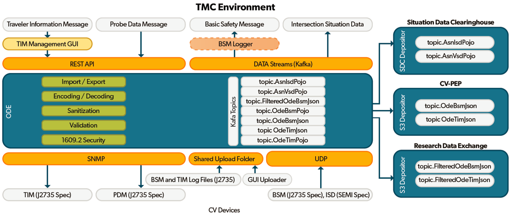
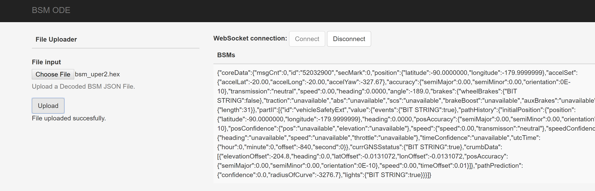
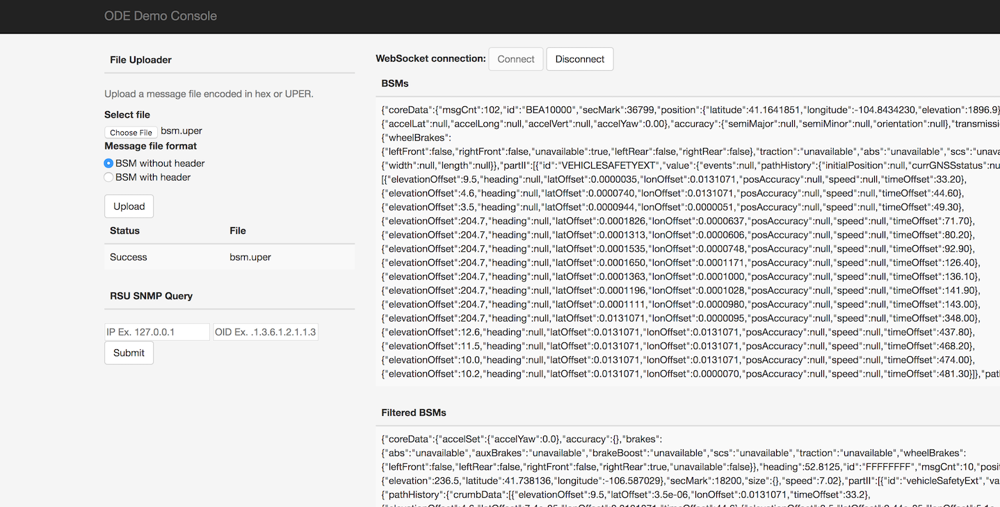

Master: [](https://travis-ci.org/usdot-jpo-ode/jpo-ode) [](https://sonarcloud.io/dashboard?id=usdot.jpo.ode%3Ajpo-ode)

Develop: [](https://travis-ci.org/usdot-jpo-ode/jpo-ode) [](https://sonarcloud.io/dashboard?id=usdot.jpo.ode%3Ajpo-ode%3Adevelop)

# jpo-ode

**US Department of Transportation (USDOT) Intelligent Transportation Systems (ITS) Joint Program Office (JPO)**
## Open Source Overview
The ITS ODE is a real-time virtual data router that ingests and processes operational data from various connected devices - including vehicles, infrastructure, and traffic management centers - and distributes it to other devices and subscribing transportation management applications. Using the ITS ODE within intelligent transportation deployments increases data fluidity and interoperability while meeting operational needs and protecting user privacy. The software’s microservices architecture makes it easy to add new capabilities to meet local needs.



### License information

Licensed under the Apache License, Version 2.0 (the "License"); you may not use this
file except in compliance with the License.
You may obtain a copy of the License at http://www.apache.org/licenses/LICENSE-2.0
Unless required by applicable law or agreed to in writing, software distributed under
the License is distributed on an "AS IS" BASIS, WITHOUT WARRANTIES OR CONDITIONS OF ANY KIND, either expressed or implied. See the License for the specific language governing
permissions and limitations under the [License](http://www.apache.org/licenses/LICENSE-2.0).

### System Requirements
Minimum memory: 16 GB
Minimum Storage Space: 100 GB
Operating systems supported: Ubuntu Linux

The ODE software can run on most standard Window or Linux based computers with 
Pentium core processors, with at least 16 gigabytes of RAM and at least 100 GB of drive space.
Performance of the software will be based on the computing power and available RAM in 
the system.  Larger data flows can require much larger space requirements depending on the 
amount of data being processed by the software. The ODE software application was developed using the open source programming language Java.  The application requires Java 8 or higher to run. The application can be run on Windows, Linux, or Mac operating systems.  

### Web sites
https://www.its.dot.gov/factsheets/pdf/ITSJPO_ODE.pdf
Application Support: ODE application support is currently manage via GitHub issue tracking: https://github.com/usdot-jpo-ode/jpo-ode/issues

### [Attribution](ATTRIBUTION.md)


<a name="toc"/>

## Table of Contents

[I. Release Notes](#release-notes)

[II. Documentation](#documentation)

[III. Collaboration Tools](#collaboration-tools)

[IV. Quickstart Guide](#quickstart-guide)

[V. Running the Application](#running)

[VI. ODE Limitation](#dev-tools)

[VII. Development Tools](#dev-tools)

[VIII. Contribution Information](#contribution-info)

[IX. Troubleshooting](#troubleshooting)

---

<a name="release-notes"/>


## [I. Release Notes](ReleaseNotes.md)


<a name="documentation"/>

## II. Documentation

ODE provides the following living documents to keep ODE users and stakeholders informed of the latest developments:

1. [ODE Architecture](docs/JPO%20ODE%20Architecture.docx)
2. [ODE User Guide](docs/JPO_ODE_UserGuide.docx)
3. [ODE Output Schema Reference Guide](docs/ODE_Output_Schema_Reference.docx)
4. [ODE REST API Guide](https://usdot-jpo-ode.github.io/)
5. [ODE Smoke Tests](https://github.com/usdot-jpo-ode/jpo-ode/wiki/JPO-ODE-QA-Documents)

All stakeholders are invited to provide input to these documents. Stakeholders should direct all input on this document to the JPO Product Owner at DOT, FHWA, and JPO. To provide feedback, we recommend that you create an "issue" in this repository (https://github.com/usdot-jpo-ode/jpo-ode/issues). You will need a GitHub account to create an issue. If you don’t have an account, a dialog will be presented to you to create one at no cost.

<a name="collaboration-tools"/>

## III. Collaboration Tools

### Source Repositories - GitHub

- Main repository on GitHub (public)
	- https://github.com/usdot-jpo-ode/jpo-ode
	- git@github.com:usdot-jpo-ode/jpo-ode.git
- Data Privacy Module on Github (public)
	- https://github.com/usdot-jpo-ode/jpo-cvdp
	- git@github.com/usdot-jpo-ode/jpo-cvdp
- S3 Depositor Module on Github (public)
	- https://github.com/usdot-jpo-ode/jpo-s3-deposit
	- gith@github.com/usdot-jpo-ode/jpo-s3-deposit
- Security services repository on GitHub (public)
        - https://github.com/usdot-jpo-ode/jpo-security-svcs.git
	- git@github.com:usdot-jpo-ode/jpo-security-svcs.git

### Agile Project Management - Jira
https://usdotjpoode.atlassian.net/secure/RapidBoard.jspa?projectKey=ODE

### Wiki - Confluence
https://usdotjpoode.atlassian.net/wiki/

### Continuous Integration and Delivery
https://travis-ci.org/usdot-jpo-ode/jpo-ode

<details><summary>Using Travis for your build</summary>
<br>
To allow Travis run your build when you push your changes to your public fork of the jpo-ode repository, you must define the following secure environment variable using Travis CLI (https://github.com/travis-ci/travis.rb).

Run:

```
travis login --org
```
Enter personal github account credentials.

In order to allow Sonar to run, personal key must be added with this command:
(Key can be obtained from the JPO-ODE development team)

```
travis env set SONAR_SECURITY_TOKEN <key> -pr <user-account>/<repo-name>
```
</details>
<br>

### Static Code Analysis
https://sonarcloud.io/organizations/usdot-jpo-ode/projects

[Back to top](#toc)

<a name="quickstart-guide"/>

## IV. Quickstart Guide

The following instructions describe the minimal procedure to fetch, build, and run the main ODE application. If you want to use the privacy protection module and/or S3 depositors, see the [extended features](#extended-features) section. Additionally, different build processes are covered in the extended features section.

Some notes before you begin:
* If you are installing the ODE in an Ubuntu environment, see this [preparation guide](https://github.com/usdot-jpo-ode/jpo-ode/wiki/Prepare-a-fresh-Ubuntu-instance-for-ODE-installation) that covers installing all of the prerequisites.
* Docker builds may fail if you are on a corporate network due to DNS resolution errors. 
[See here](https://github.com/usdot-jpo-ode/jpo-ode/wiki/Docker-fix-for-SSL-issues-due-to-corporate-network) for instructions to fix this.
* Additionally *git* commands may fail for similar reasons, you can fix this by running `export GIT_SSL_NO_VERIFY=1`.
* Windows users may find more information on installing and using Docker [here](https://github.com/usdot-jpo-ode/jpo-ode/wiki/Docker-management).
* Users interested in Kafka may find more guidance and configuration options [here](docker/kafka/README.md).

### Prerequisites
* JDK 1.8: http://www.oracle.com/technetwork/pt/java/javase/downloads/jdk8-downloads-2133151.html
* Maven: https://maven.apache.org/install.html
* Git: https://git-scm.com/
* Docker: https://docs.docker.com/engine/installation/
* Docker-Compose: https://docs.docker.com/compose/install/

Read the following guides to familiarize yourself with ODE's Docker and Kafka modules.

**Docker**

[README](docker.md)

**Kafka**

[README](kafka.md)

---
### Obtain the Source Code

#### Step 0 - For Windows Users Only
If running on Windows, please make sure that your global git config is set up to not convert End-of-Line characters during checkout. 

Disable `git core.autocrlf` (One Time Only)

```bash
git config --global core.autocrlf false
```

#### Step 1 - Download the Source Code
ODE software consists of the following modules hosted on GitHub:

|Name|Visibility|Description|
|----|----------|-----------|
|[jpo-ode](https://github.com/usdot-jpo-ode/jpo-ode)|public|Contains the public components of the application code.|
|[jpo-cvdp](https://github.com/usdot-jpo-ode/jpo-cvdp)|public|Privacy Protection Module|
|[jpo-s3-deposit](https://github.com/usdot-jpo-ode/jpo-s3-deposit)|public|S3 depositor service. Optional, comment out of `docker-compose.yml` file if not used.|
|[asn1_codec](https://github.com/usdot-jpo-ode/asn1_codec)|public|ASN.1 Encoder/Decoder module|
|[jpo-security-svcs](https://github.com/usdot-jpo-ode/jpo-security-svcs)|public|Provides cryptographic services.|

To download the stable (default branch) source code for the first time, clone the repositories by running the following commands:

```bash
git clone --recurse-submodules https://github.com/usdot-jpo-ode/jpo-ode.git
```
*Note*: Make sure you specify the --recurse-submodules option on the clone command line. This option will cause the cloning of all dependent submodules:
- Privacy Protection Module (PPM) - [jpo-cvdp](https://github.com/usdot-jpo-ode/jpo-cvdp)
- S3 Bucket Depositor - [jpo-s3-deposit](https://github.com/usdot-jpo-ode/jpo-s3-deposit)
- Security Services Module- [jpo-security](https://github.com/usdot-jpo-ode/jpo-security-svcs)
- ASN.1 CODEC - [asn1_codec](https://github.com/usdot-jpo-ode/asn1_codec)

Once you have these repositories obtained, you are ready to build and deploy the application.

##### Downloading the source code from a non-default branch
The above steps to pull the code from GitHub repository pulls it from the default branch which is the stable branch. If you wish to pull the source code from a branch that is still under development or beta testing, you will need to specify the branch to pull from. The following commands aid you in that action.
```
# Backup user provided source or configuration files used by submodules
cp asn1_codec/asn1c_combined/J2735_201603DA.ASN .

#Run the following commands to reset existing branch
git reset --hard
git submodule foreach --recursive git reset --hard

# Pull from the non-default branch
git checkout <branch_name>
git pull origin <branch_name>

# The next command wipes out all of the submodules and re-initializes them. 
git submodule deinit -f . && git submodule update --recursive --init

# Restore user provided source or configuration files used by submodules
cp ./J2735_201603DA.ASN asn1_codec/asn1c_combined/
```
**Note**: *These commands can also be performed using the provided script `update_branch`.*

---
### Build and Deploy the Application

ODE uses Docker for building and running the executable. Familiarize yourself with Docker and follow the instructions in the [README.md](docker/README.md).

#### Step 1: Configuration
If you wish to change the application properties, such as change the location of the upload service via `ode.uploadLocation.*` properties or set the `ode.kafkaBrokers` to something other than the $DOCKER_HOST_IP:9092, or wish to set the CAS username/password, `ODE_EXTERNAL_IPVs`, etc. instead of setting the environment variables, modify `jpo-ode-svcs\src\main\resources\application.properties` file as desired.

ODE configuration can be customized for every deployment environment using environment variables. These variables can either be set locally or using the *sample.env* file found in the root of the `jpo-ode` repository.

Instructions for how to use the *sample.env* file can be found [here](https://github.com/usdot-jpo-ode/jpo-ode/wiki/Using-the-.env-configuration-file).

**Important!** 
You must rename `sample.env` to `.env` for Docker to automatically read the file. This file will contain AWS access keys and other private information. Do not push this file to source control.

#### Build Process

**Note** Docker builds may fail if you are on a corporate network due to DNS resolution errors. 
[See here](https://github.com/usdot-jpo-ode/jpo-ode/wiki/Docker-fix-for-SSL-issues-due-to-corporate-network) for instructions to fix this.

**Note** In order for Docker to automatically read the environment variable file, you must rename it from `sample.env` to `.env`.

#### Step 2: Build and deploy the application.

Copy the following files from `jpo-ode` directory into your DOCKER_SHARED_VOLUME directory.
- Copy jpo-ode/ppm.properties to ${DOCKER_SHARED_VOLUME}/config.properties. Open the newly copied `config.properties` file in a text editor and update the `metadata.broker.list=your.docker.host.ip:9092` line with your system's DOCKER_HOST_IP in place of the dummy `your.docker.host.ip` string. 
- Copy jpo-ode/adm.properties to ${DOCKER_SHARED_VOLUME}/adm.properties
- Copy jpo-ode/aem.properties to ${DOCKER_SHARED_VOLUME}/aem.properties

Navigate to the root directory of the jpo-ode project and run the following command:
```
docker-compose up --build -d
docker-compose ps
```
To bring down the services and remove the running containers run the following command:
```
docker-compose down
```
For a fresh restart, run:
```
docker-compose down
docker-compose up --build -d
docker-compose ps
```
Check the deployment by running `docker-compose ps`. You can start and stop containers using `docker-compose start` and `docker-compose stop` commands.
If using the multi-broker docker-compose file, you can change the scaling by running `docker-compose scale <container>=n` where container is the container you would like to scale and n is the number of instances. For example, `docker-compose scale kafka=3`.

#### Running ODE Application on localhost
You can run the application on your local machine while other services are deployed on a host environment. To do so, run the following:
```bash
 docker-compose start zookeeper kafka
 mvn clean install
 java -jar jpo-ode-svcs/target/jpo-ode-svcs-0.0.1-SNAPSHOT.jar
```

[Back to top](#toc)

<a name="running"/>

## V. Using ODE Application
Once the ODE is deployed and running, you should be able to access the `jpo-ode` web UI at `localhost:8080`.

1. Press the `Connect` button to connect to the ODE WebSocket service.
2. Press `Choose File` button to select an OBU log file containing BSMs and/or TIM messages as specified by the WYDOT CV Pilot project. See below documents for details:
a. [Wyoming CV Pilot Log File Design](data/Wyoming_CV_Pilot_Log_File_Design.docx) 
b. [WYDOT Log Records](data/wydotLogRecords.h) 
3. Press `Upload` button to upload the file to ODE.

Upload records within the files must be embedding BSM and/or TIM messages wrapped in J2735 MessageFrame and ASN.1 UPER encoded, wrapped in IEEE 1609.2 envelope and ASN.1 COER encoded binary format. The following files are a samples of each supported type. Uploading any of the files below will you will observe the decoded messages returned to the web UI page while connected to the WebSocket interface:

 - [data/bsmLogDuringEvent.bin](data/bsmLogDuringEvent.bin)
 - [data/bsmLogDuringEvent.gz](data/bsmLogDuringEvent.gz)
 - [data/bsmTx.bin](data/bsmTx.bin)
 - [data/bsmTx.gz](data/bsmTx.gz)
 - [data/dnMsg.bin](data/dnMsg.bin)
 - [data/dnMsg.gz](data/dnMsg.gz)
 - [data/rxMsg_BSM.bin](data/rxMsg_BSM.bin)
 - [data/rxMsg_BSM.gz](data/rxMsg_BSM.gz)
 - [data/rxMsg_TIM.bin](data/rxMsg_TIM.bin)
 - [data/rxMsg_TIM.gz](data/rxMsg_TIM.gz)

Another way data can be uploaded to the ODE is through copying the file to the location specified by the `ode.uploadLocationRoot/ode.uploadLocationObuLog`property. If not specified,  Default locations would be `uploads/bsmlog`sub-directory off of the location where ODE is launched.

The result of uploading and decoding of messages will be displayed on the UI screen.



*Notice that the empty fields in the J2735 message are represented by a `null` value. Also note that ODE output strips the MessageFrame header and returns a pure BSM or TIM in the subscription topic.*

### asn1_codec Module (ASN.1 Encoder and Decoder)
ODE requires the deployment of asn1_codec module. ODE's `docker-compose.yml` file is set up to build and deploy the module in a Docker container. If you wish to run `asn1_codec` module outside Docker (i.e. directly on the host machine), please refer to the documentation of `asn1_codec` module.

The only requirement for deploying `asn1_codec` module on Docker is the setup of two environment variables `DOCKER_HOST_IP` and `DOCKER_SHARED_VOLUME`.

### PPM Module (Geofencing and Filtering)

To run the ODE with PPM module, you must install and start the PPM service. PPM service communicates with other services through Kafka Topics. PPM will read from the specified "Raw BSM" topic and publish the result to the specified "Filtered Bsm" topic. These topic names are specified by the following ODE and PPM properties:

 - ODE properties for communications with PPM (set in application.properties)
	 - ode.kafkaTopicOdeBsmJson  (default = topic.OdeBsmJson)
	 - ode.kafkaTopicFilteredOdeBsmJson (default = topic.FilteredOdeBsmJson)
 - PPM properties for communications with ODE (set in yourconfig.properties)
	 - privacy.topic.consumer (default = j2735BsmRawJson)
	 - privacy.topic.producer (default = j2735BsmFilteredJson)

Follow the instructions [here](https://github.com/usdot-jpo-ode/jpo-cvdp/blob/master/docs/installation.md) (https://github.com/usdot-jpo-ode/jpo-cvdp/blob/master/docs/installation.md) to install and build the PPM service.

During the build process, edit the sample config file located in `config/example.properties` and point the property `metadata.broker.list` towards the host of your docker machine or wherever the kafka brokers are hosted. You may use the command `docker-machine ls` to find the kafka service.

After a successful build, use the following commands to configure and run the PPM

```
cd $BASE_PPM_DIR/jpo-cvdp/build
$ ./bsmjson_privacy -c ../config/ppm.properties
```
With the PPM module running, all filtered BSMs that are uploaded through the web interface will be captured and processed. You will see an output of both submitted BSM and processed data unless the entire record was filtered out.




[Back to top](#toc)

<a name="ode-limitation"/>

## VI. ODE Limitations

Date: 07/2017

In its current state, the ODE has been developed to accomplish the goals of data transfer, security, and modularity working with the J2735 and 1609.2 security. The system has been designed to support multiple services orchestrated through the Apache Kafka streaming data pipelines, services built and supported as separate applications and described with each service's repository. As a modular system, each component has been built for functionality first, and additional performance testing is needed to understand the limits of the system with large volumes of data.

<a name="dev-tools"/>

## VII. Development Tools

### Integrated Development Environment (IDE)

Install the IDE of your choice:

* Eclipse: [https://eclipse.org/](https://eclipse.org/)
* STS: [https://spring.io/tools/sts/all](https://spring.io/tools/sts/all)
* IntelliJ: [https://www.jetbrains.com/idea/](https://www.jetbrains.com/idea/)

### Continuous Integration

* TravisCI: https://travis-ci.org/usdot-jpo-ode/jpo-ode

### Continuous Deployment

To be added.

<a name="contribution-info"/>

## VIII. Contribution Information

Please read our [contributing guide](docs/contributing_guide.md) to learn about our development process, how to propose pull requests and improvements, and how to build and test your changes to this project.

<a name="troubleshooting"/>

## IX. Troubleshooting

Please read our [Wiki](https://github.com/usdot-jpo-ode/jpo-ode/wiki) for more information, or check the [ODE User Guide](https://github.com/usdot-jpo-ode/jpo-ode/raw/develop/docs/JPO_ODE_UserGuide.docx).

[Back to top](#toc)
