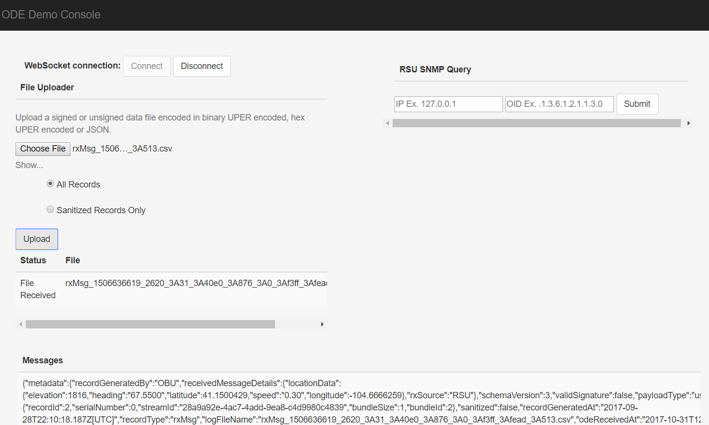

Master: [](https://travis-ci.org/usdot-jpo-ode/jpo-ode) [](https://sonarqube.com/dashboard/index?id=us.dot.its.jpo.ode%3Ajpo-ode)

Develop: [](https://travis-ci.org/usdot-jpo-ode/jpo-ode) [](https://sonarqube.com/dashboard/index?id=us.dot.its.jpo.ode%3Ajpo-ode%3Adevelop)

# jpo-ode
US Department of Transportation Joint Program office (JPO) Operational Data Environment (ODE)

In the context of ITS, an Operational Data Environment is a real-time data acquisition and distribution software system that processes and routes data from Connected-X devices –including connected vehicles (CV), personal mobile devices, and infrastructure components and sensors –to subscribing applications to support the operation, maintenance, and use of the transportation system, as well as related research and development efforts.

## Release Notes
### Sprint 8
- ODE-143 Outbound TIM Message Parameters - Phase 2
- ODE-146 Provide generic SDW Deposit Capability
- ODE-147 Deposit TIM message to SDW

### Sprint 7
- ODE-125 Expose empty field ODE output records when presented in JSON format
- ODE-142 Outbound TIM Message Parameters - Phase 1
- ODE-169 Encode TIM Message to ASN.1 - Outbound
- ODE-171 Research 1609.2 Standard Implementation

### Sprint 6
- ODE-138 Add Capability for Raw BSM Data (bin format only) with Header Information
- ODE-150 Encode TIM Message to ASN.1 (Inbound messages only)
- ODE-148 Develop More Robust User Facing Documentation

### Sprint 5
- ODE-126 ADD to ODE 58 - Log ODE Data Flows On/off without restarting ODE
- ODE-74 RESTful SNMP Wrapper Service to pass SNMP messages to an RSU
- ODE-127 Defined future story and tasks for inbound/outbound TIM messages

### Sprint 4
- ODE-123 Developed a sample client application to interface directly with Kafka service to subscribe to ODE data
- ODE-118 Validate BSM data decoding, inclusing Part II, with real binary data from OBU
- ODE-54 Authored first draft of ODE User Guide
- ODE-58 Developed ODE Event Logger
- ODE-41 Importer improvements

### Sprint 3
- ODE-42 Clean up the kafka adapter and make it work with Kafka broker. Integrated kafka. Kept Stomp as the high level WebSocket API protocol.
- ODE-36 - Docker, docker-compose, Kafka and ode Integration

## Documentation
ODE provides the following living documents to keep ODE users and stakeholders informed of the latest developments:

1. [docs/JPO_ODE_Architecture.pdf](docs/JPO_ODE_Architecture.pdf)
2. [docs/JPO_ODE_User_Guide.pdf](docs/JPO_ODE_User_Guide.pdf)

All stakeholders are invited to provide input to these documents. Stakeholders should direct all input on this document to the JPO Product Owner at DOT, FHWA, JPO. To provide feedback, we recommend that you create an "issue" in this repository (https://github.com/usdot-jpo-ode/jpo-ode/issues). You will need a GitHub account to create an issue. If you don’t have an account, a dialog will be presented to you to create one at no cost.

## Collaboration Tools

### Source Repositories - GitHub
- Main repository on GitHub (public)
	- https://github.com/usdot-jpo-ode/jpo-ode
	- git@github.com:usdot-jpo-ode/jpo-ode.git
- Private repository on BitBucket
	- https://usdot-jpo-ode@bitbucket.org/usdot-jpo-ode/jpo-ode-private.git
	- git@bitbucket.org:usdot-jpo-ode/jpo-ode-private.git

### Agile Project Management - Jira
https://usdotjpoode.atlassian.net/secure/Dashboard.jspa

### Wiki - Confluence
https://usdotjpoode.atlassian.net/wiki/

### Continuous Integration and Delivery
https://travis-ci.org/usdot-jpo-ode/jpo-ode

To allow Travis run your build when you push your changes to your public fork of the jpo-ode repository, you must define the following secure environment variable using Travis CLI (https://github.com/travis-ci/travis.rb).

Run:

```
travis login --org
```
Enter personal github account credentials and then run this:

```
travis env set PRIVATE_REPO_URL_UN_PW 'https://<bitbucketusername>:<password>@bitbucket.org/usdot-jpo-ode/jpo-ode-private.git' -r <travis username>/jpo-ode
```

The login information will be saved and this needs to be done only once.

In order to allow Sonar to run, personal key must be added with this command:
(Key can be obtained from the JPO-ODE development team)

```
travis env set SONAR_SECURITY_TOKEN <key> -pr <user-account>/<repo-name>
```

### Static Code Analysis
https://sonarqube.com/dashboard/index?id=us.dot.its.jpo.ode%3Ajpo-ode%3Adevelop

## Getting Started

### Prerequisites
* JDK 1.8: http://www.oracle.com/technetwork/pt/java/javase/downloads/jdk8-downloads-2133151.html
* Maven: https://maven.apache.org/install.html
* Git: https://git-scm.com/

### Instructions

The following instructions describe the procedure to fetch, build and run the application.

#### Getting the source Code

**Step 1**: Disable Git core.autocrlf (Only the First Time)
**NOTE**: If running on Windows, please make sure that your global git config is set up to not convert End-of-Line characters during checkout. This is important for building docker images correctly.

```bash
git config --global core.autocrlf false
```

**Step 2**:  Clone the source code from GitHub and BitBucket repositories using Git commands:

```bash
git clone https://github.com/usdot-jpo-ode/jpo-ode.git
git clone https://usdot-jpo-ode@bitbucket.org/usdot-jpo-ode/jpo-ode-private.git
```

**Step 3**:  Follow the instructions in the ![docker/README.me]

#### Building Private Repository

To build the application use maven command line.

**Step 4**: Navigate to the root directory of the jpo-ode-private project:

```bash
 cd jpo-ode-private/
 mvn clean
 mvn install
```
It is important you run mvn clean first and then mvn install because mvn clean installs the required OSS jar file in your maven local repository.

#### Building and deploying ODE
**Step 5**: Navigate to the root directory of the jpo-ode project.

**Step 6**: (Optional Step) If you wish to change the application properties, such as change the location of the upload service via ode.uploadLocation property or set the ode.kafkaBrokers to something other than the $DOCKER_HOST_IP:9092, modify ```jpo-ode-svcs\src\main\resources\application.properties``` file as desired.

**Step 7**: The easiest and cleanest way to build and run the ODE in a docker container would be to run the ```clean-build-and-deploy``` script. This script executes the following commands:

```bash
#!/bin/bash
docker-compose stop
docker-compose rm -f -v
mvn clean install
docker-compose up --build -d
docker-compose ps
```

#### Building ODE without Deploying
To build the ODE docker container images but not deploy it, run the following commands:

```bash
 cd jpo-ode (or cd ../jpo-ode if you are in the jpo-ode-private directory)
 mvn clean install
 docker-compose rm -f -v
 docker-compose build
```

Alternatively, you may run the ```clean-build``` script.

#### Deploying ODE Application on a Docker Host
To deploy the the application on the docker host configured in your DOCKER_HOST_IP machine, run the following:

```bash
docker-compose up --no-recreate -d
```

**NOTE**: It's important to run ```docker-compose up``` with ```no-recreate``` option. Otherwise you may run into [this issue] (https://github.com/wurstmeister/kafka-docker/issues/100).

Alternatively, run ```deploy``` script.

Check the deployment by running ```docker-compose ps```. You can start and stop service using ```docker-compose start``` and ```docker-compose stop``` commands.
If using the multi-broker docker-compose file, you can change the scaling by running ```docker-compose scale <service>=n``` where service is the service you would like to scale and n is the number of instances. For example, ```docker-compose scale kafka=3```.

#### Running ODE Application on localhost
You can run the application on your local machine while other services are deployed on a host environment. To do so, run the following:
```bash
 docker-compose start zookeeper kafka
 java -jar jpo-ode-svcs/target/jpo-ode-svcs-0.0.1-SNAPSHOT.jar
```

#### Testing ODE Application
You should be able to access the jpo-ode UI at `localhost:8080`.

1. Press the ```Connect``` button to connect to the ODE WebSocket service.
2. Press ```Choose File``` button to select a file with J2735 BSM or MessageFrame records in ASN.1 UPER encoding
3. Press ```Upload``` button to upload the file to ODE.

Upload a file containing BSM messages or J2735 MessageFrame in ASN.1 UPER encoded binary format. For example, try the file [data/bsm.uper](data/bsm.uper) or [data/messageFrame.uper](data/messageFrame.uper) and observe the decoded messages returned to the web UI page while connected tot he WebSocket interface.

Alternatively, you may upload a file containing BSM messages in ASN.1 UPER encoded hexadecimal format. For example, a file containing the following pure BSM record and a file extension of ```.hex``` or  ```.txt``` would be processed and decoded by the ODE and results returned to the web UI page:
```text
401480CA4000000000000000000000000000000000000000000000000000000000000000F800D9EFFFB7FFF00000000000000000000000000000000000000000000000000000001FE07000000000000000000000000000000000001FF0
```
*Note: Hexadecimal file format is for test purposes only. ODE is not expected to receive ASN.1 data records in hexadecimal format from the field devices.*

Another way data can be uploaded to the ODE is through copying the file to the location specified by the ```ode.uploadLocationRoot/ode.uploadLocationBsm``` or ```ode.uploadLocationRoot/ode.uploadLocationMessageFrame``` property. If not specified,  Default locations would be ```uploads/bsm``` and ```uploads/messageframe``` sub-directories off of the location where ODE is launched.

The result of uploading and decoding of the message will be displayed on the UI screen.



*Notice that the empty fields in the J2735 message are represented by a ```null``` value. Also note that ODE output strips the MessageFrame header and returns a pure BSM in the J2735 BSM subscription topic.*
### Integrated Development Environment (IDE)

Install the IDE of your choice:

* Eclipse: [https://eclipse.org/](https://eclipse.org/)
* STS: [https://spring.io/tools/sts/all](https://spring.io/tools/sts/all)
* IntelliJ: [https://www.jetbrains.com/idea/](https://www.jetbrains.com/idea/)

### Continuous Integration and Delivery

### Deployment

## Docker


## Kafka

