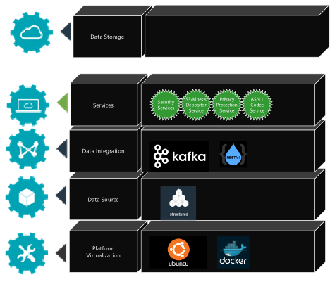
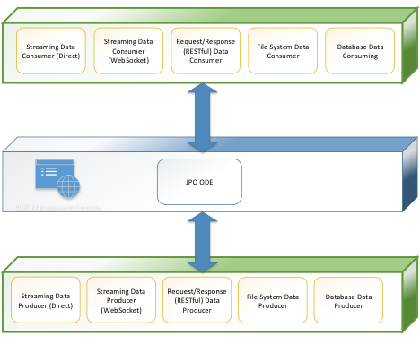
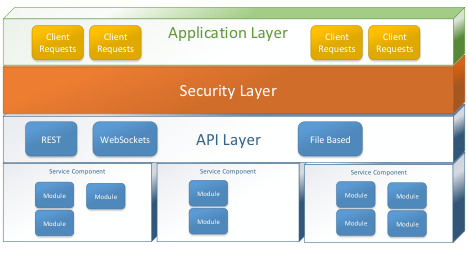
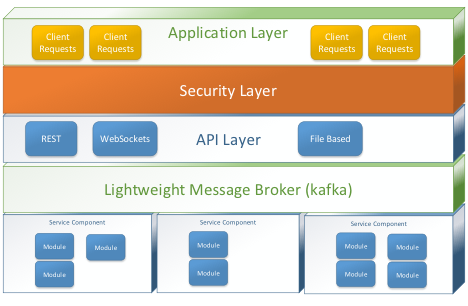
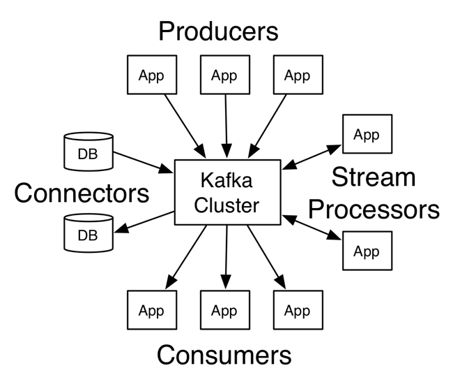
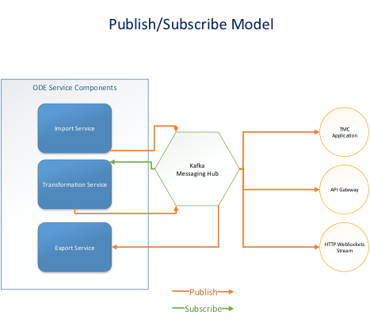
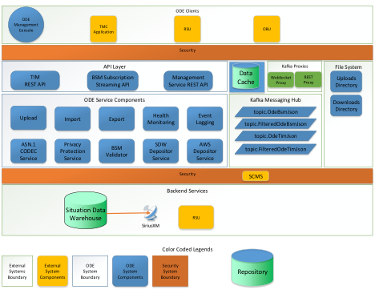

# JPO Operational Data Environment Interim Design Document

**Contract:** DTFH6116D00035\
**TOPR:** HOIT212116217

**Submitted to**\
U.S. Department of Transportation (USDOT)\
Federal Highway Administration ITS JPO

**Prepared by**\
Booz Allen Hamilton\
8283 Greensboro Drive\
McLean, VA 22102

_Last updated June 11, 2021_

# Contents

- [Version History](#version-history)
- [1 - Introduction](#introduction)
- [2 - Project Overview](#project-overview)
- [3 - System Overview](#system-overview)
  - [3.1 - ODE Technology Stack](#ode-technology-stack)
  - [3.2 - Producer Mechanisms](#producer-mechanisms)
  - [3.3 - Consumer Mechanisms](#consumer-mechanisms)
  - [3.4 - ODE Management Console](#ode-management-console)
- [4 - Architecture Pattern](#architecture-pattern)
  - [4.1 - Pattern Description](#pattern-description)
  - [4.2 - Pattern Topology](#pattern-topology)
- [5 - JPO ODE Micro-services Topology](#jpo-ode-micro-services-topology)
  - [5.1 - Deployments](#deployments)
- [6 - Appendix](#appendix)
  - [6.1 - Glossary](#glossary)

<a name="version-history">

# Version History

| Version # | Implemented By | Revision Date                                     | What Changed?                                     |
|-----------|----------------|---------------------------------------------------|---------------------------------------------------|
| 1.0       | Hamid Musavi   |                                                   |                                                   |
| Tony Chen | 1/11/2017      | Initial release of the preliminary/interim design |                                                   |
| 1.1       | Hamid Musavi   | 4/17/2017                                         | Updated to reflect ORNL De-identification service |
| 1.2       | Hamid Musavi   | 12/21/2018                                        | General Update                                    |

<a name="introduction">

# 1 - Introduction

The JPO Operational Data Environment (ODE) product is being developed
under Agile Development Methodologies, using an open architecture
approach, in an open source environment. This document describes the
preliminary architectural design of the JPO ODE and its interfaces with
external systems including the TMC applications, field devices and
center services.

All stakeholders are invited to provide input to this document.
Stakeholders should direct all input on this document to the JPO Product
Owner at DOT, FHWA, JPO.

This document is a living document and will be updated throughout the
life of the JPO ODE project to reflect the most recent changes in the
ODE design and stakeholder feedback.

<a name="project-overview">

# 2 - Project Overview

An Operational Data Environment is a real-time data acquisition and
distribution software system that processes and routes data from
Connected-X devices -- including connected vehicles (CV), personal
mobile devices, infrastructure components, and sensors -- to subscribing
applications to support the operation, maintenance, and use of the
transportation system, as well as related research and development
efforts.

The ODE is intended to complement a connected vehicle infrastructure by
brokering, processing and routing data from various data sources,
including connected vehicles, field devices, Transportation Management
Center (TMC) applications and a variety of other data users. Data users
include but not limited to transportation software applications,
Research Data Exchange (RDE), US DOT Situation Data Warehouse.

As a data provisioning service, the ODE can provision data from
disparate data sources to software applications that have placed data
subscription requests to the ODE. On the other direction, the ODE can
accept data from CV applications and broadcast them to field devices
through Road Side Units (RSU) and US DOT Situation Data Warehouse which
in turn will transmit the data to Sirius XM satellites for delivery to
the connected vehicles in the field.

While provisioning data from data sources to data users, the ODE also
will perform necessary security / credential checks and, as needed, data
validation and sanitization.

-   Data validation is the process of making a judgment about the
    quality of the data and handling invalid data as prescribed by the
    system owners.

-   Data sanitization is the modification of data as originally received
    to reduce or eliminate the possibility that the data can be used to
    compromise the privacy of the individual(s) that might be linked to
    the data.

<a name="system-overview">

# 3 - System Overview

JPO ODE is an open-source software application that will enable the
transfer of data between field devices and backend TMC systems for
operational, monitoring, and research purposes. The system will enable
applications to submit data through a variety standard interfaces as
illustrated in the figure below.

<a name="ode-technology-stack">

### 3.1 - ODE Technology Stack

Figure 1 illustrates the JPO ODE technology stack and components within
each technology layer.

Figure 1 - ODE Technology Stack

Data Integration later of JPO-ODE supports the producers and consumers
of CV data as illustrated in Figure 2 below. Not all components or
services shown in this diagram have been implemented. *The
implementation timeline for the identified interfaces will depend on the
needs of the JPO ODE customers and the priority of these capabilities to
the JPO-ODE product owner.*

Figure 2 - ODE Data Integration Clients

<a name="producer-mechanisms">

### 3.2 - Producer Mechanisms

The JPO-ODE architecture is designed to support the following mechanisms
for inputting ASN.1 encoded Basic Safety Messages (BSM)s, Traveler
Information Messages (TIM)s in a human readable Java Script Object
Notation (JSON), environmental and various other system logs.

-   **Streaming Data Producers (Direct):** Applications can directly
    interact with the messaging service through the use of the service's
    native API and publish messages to be processed by the ODE. *This
    interface is suitable only to applications residing inside a private
    network domain.*

-   **Streaming Data Producers (WebSocket):** Applications can interact
    with the messaging service and publish messages to be processed by
    the ODE. *This interface is suitable to all applications whether
    residing in the private network domain or in the cloud. For cloud
    applications Secure WebSocket (wss) protocol will be required.*

-   **RESTful API Data Producers:** Applications can connect with the
    ODE though a RESTful API and submit messages to the messaging
    service through HTTP POST commands. *This interface is suitable to
    all applications whether residing in the private network domain or
    in the cloud. For cloud applications Secure HTTP (https) protocol
    should be utilized.*

-   **File System Data Producers**: Encoded message files and log files
    messages can be dropped into a shared file system location and
    systematically pulled in to the data broker. *This interface is
    suitable to applications residing in the private network domain or
    in the cloud. This interface should only be utilized with Secure
    Copy (scp) protocol.*

-   **Database Data Producer:** A shared database where encoded messages
    are stored can also be connected directly into the ODE to monitor
    and process new records. *This interface is suitable only to
    applications residing in the private network domain.*

<a name="consumer-mechanisms">

### 3.3 - Consumer Mechanisms

The JPO-ODE is designed to support the following mechanisms for
outputting decoded BSM, Map and Signal Phase and Timing (SPaT) data as
well as encoded TIM data.

-   **Streaming Data Consumers (Direct):** Applications can subscribe
    directly to the messaging service through the use of the messaging
    service's native API. *This interface is suitable only to
    applications residing in the private network domain.*

-   **Streaming Data Consumers (WebSocket):** Applications can subscribe
    to the messaging service through the use of a standard WebSocket
    API. *This interface is suitable to all applications whether
    residing in the private network domain or in the cloud. For cloud
    applications Secure WebSocket (wss) protocol should be utillized.*

-   **RESTful API Data Consumers:** Applications can connect directly
    with a RESTful API and submit messages to the messaging service
    through HTTP commands. *This interface is suitable to all
    applications whether residing in the private network domain or in
    the cloud. For cloud applications Secure HTTP (https) protocol
    should be utilized.*

-   **File System Data Consumers:** Through the use of a shared file
    repository, applications can monitor collection of data messages.
    *This interface is suitable to applications residing in the private
    network domain or in the cloud. This interface should be utilized
    through Secure Copy (scp) protocol.*

-   **Database Data Consumers**: Data messages can be directly inserted
    into a shared application database and made available for queries.

<a name="ode-management-console">

### 3.4 - ODE Management Console

ODE is envisioned to provide a management console for functions such as
SNMP device management and provisioning. Other configuration functions
can be included in a future management console.

<a name="architecture-pattern">

# 4 - Architecture Pattern

JPO ODE architecture is loosely based on a micro-services architecture
pattern. The micro-services architecture pattern is a highly scalable
design pattern and a viable alternative to monolithic applications1
and service-oriented architectures.

1 _In software engineering, a **monolithic application** describes a single-tiered software **application** in which the user interface and data access code are combined into a single program from a single platform. A **monolithic application** is self-contained, and independent from other computing **applications**._

<a name="pattern-description">

### 4.1 - Pattern Description

The micro-services pattern consists of three major concepts:

1.  *Separately deployed units*: As illustrated in Figure 2, each
    component of the micro-services architecture is deployed as a
    separate unit, allowing for easy deployment, increased scalability,
    and a high degree of component decoupling.

2.  *Service component*: In micro-services architecture, we deal with
    service components, which can vary in granularity from a single
    module to a large portion of the application. Service components
    contain one or more modules (Java classes) that represent either a
    single-purpose function (e.g., decode BSMs from ASN.1) or an
    independent portion of a large business application (e.g., sanitize
    BSM data according to the client request).

3.  *Distributed architecture*: All the components within the
    architecture are fully decoupled from one other and accessed through
    a messaging service. This concept is what allows microservices
    architecture pattern achieve some of its superior scalability and
    deployment characteristics.

_Figure 3 - Basic Micro-services architecture pattern_

<a name="pattern-topology">

### 4.2 - Pattern Topology

For JPO ODE, a *centralized messaging* topology is being envisioned.
This topology (illustrated In Figure 3) uses a lightweight centralized
message broker (e.g., Kafka). The lightweight message broker found in
this topology does not perform any orchestration, transformation, or
complex routing; rather, it is just a lightweight transport to access
remote service components. The single point of failure and architectural
bottleneck issues usually associated with a centralized broker are
addressed through broker clustering.

_Figure 4 - Centralized Messaging Topology_

Broker clustering refers to the ability of the message broker to scale
horizontally and proportionally with the demands of the connected
applications and services, ensuring the reliability of the messages
rerouted through the broker. If needed, the message brokers can be
distributed across multiple nodes to continue to provide services
despite outages of one or more nodes and be able to scale in and out
automatically as the data volume scales down and up.

If broker clustering is utilized, however, messages will not be
guaranteed to be delivered in the same order as they arrived. In that
case another caching service or data store will be responsible for
re-ordering the messages based on a sequence key.

Apache Kafka is the messaging framework that is incorporated in the JPO
ODE implementation.

Figure 4 below highlights the concepts used in the Kafka implementation.
Kafka has three key capabilities:

1.  Publish/Subscribe: It lets you publish and subscribe to streams of
    records. In this respect it is similar to a message queue or
    enterprise messaging system.

2.  Persistent and Reliable: It lets you store streams of records in a
    fault-tolerant way.

3.  Stream Processing: It lets you process streams of records as they
    occur.

_Figure 5 - Kafka Concepts_

In order to connect to Kafka, there are 4 core API's that systems can
use to communicate with the broker.

-   The [Producer
    API](https://kafka.apache.org/documentation.html#producerapi) allows
    an application to publish a stream of records to one or more Kafka
    topics.

-   The [Consumer
    API](https://kafka.apache.org/documentation.html#consumerapi) allows
    an application to subscribe to one or more topics and receive a
    stream of records. Multiple applications can subscribe to a single
    topic and process messages in parallel via Kafka's consumer group
    handling.

-   The [Streams
    API](https://kafka.apache.org/documentation.html#streams) allows an
    application to act as a *stream processor*, consuming an input
    stream from one or more topics and producing an output stream to one
    or more output topics, effectively transforming the input streams to
    output streams.

-   The [Connector
    API](https://kafka.apache.org/documentation.html#connect) allows
    building and running reusable producers or consumers that connect
    Kafka topics to existing applications or data systems. For example,
    a connector to a relational database might capture every change to a
    table.

The ODE utilizes these Kafka concepts and the framework has been
designed as depicted in Figure 6.

-   The input services represent the publisher into the system.

-   The BSM decoder service consumes an encoded topic and published a
    decoded topic.

-   Applications such as the TM Application and gateways consume the
    outputted decoded messages.

_Figure 6 - Kafka Publish/Subscribe Model_

<a name="jpo-ode-micro-services-topology">

# 5 - JPO ODE Micro-services Topology

Figure 6 below represents the micro-services topology envisioned for JPO
ODE. It highlights the granularity of ODE micro-services and identifies
the major architectural components with which these services interact.

_Figure 7 - JPO ODE Micro-services Topology_

<a name="deployments">

### 5.1 - Deployments

Docker is utilized as the primary deployment mechanism to
compartmentalize each of the designed micro-services into separate
containers. Docker is used to package all components in a composite of
containers each running a distinct service. The ODE application runs in
one container and other major frameworks such as ZooKeeper and Kafka run
in their own separate containers.

<a name="appendix">

# 6 - Appendix

<a name="glossary">

### 6.1 - Glossary

| Term      | Description                                                                                                                                                                                                                                                                                             |
|-----------|---------------------------------------------------------------------------------------------------------------------------------------------------------------------------------------------------------------------------------------------------------------------------------------------------------|
| API       | Application Program Interface                                                                                                                                                                                                                                                                           |
| ASN.1     | Abstract Syntax Notation One (ASN.1) is a standard and notation that describes rules and structures for representing, encoding, transmitting, and decoding data in telecommunications and computer networking                                                                                           |
| JPO       | Joint Program Office                                                                                                                                                                                                                                                                                    |
| Kafka     | Apache Kafka is publish-subscribe messaging rethought as a distributed commit log.                                                                                                                                                                                                                      |
| SCP       | Secure Copy                                                                                                                                                                                                                                                                                             |
| US DOT    | Unites States Department of Transportation                                                                                                                                                                                                                                                              |
| WebSocket | WebSocket is designed to be implemented in web browsers and web servers, but it can be used by any client or server application. The WebSocket Protocol is an independent TCP-based protocol. Its only relationship to HTTP is that its handshake is interpreted by HTTP servers as an Upgrade request. |
| ZooKeeper | Apache ZooKeeper is a centralized service for maintaining configuration information, naming, providing distributed synchronization, and providing group services.                                                                                                                                       |
