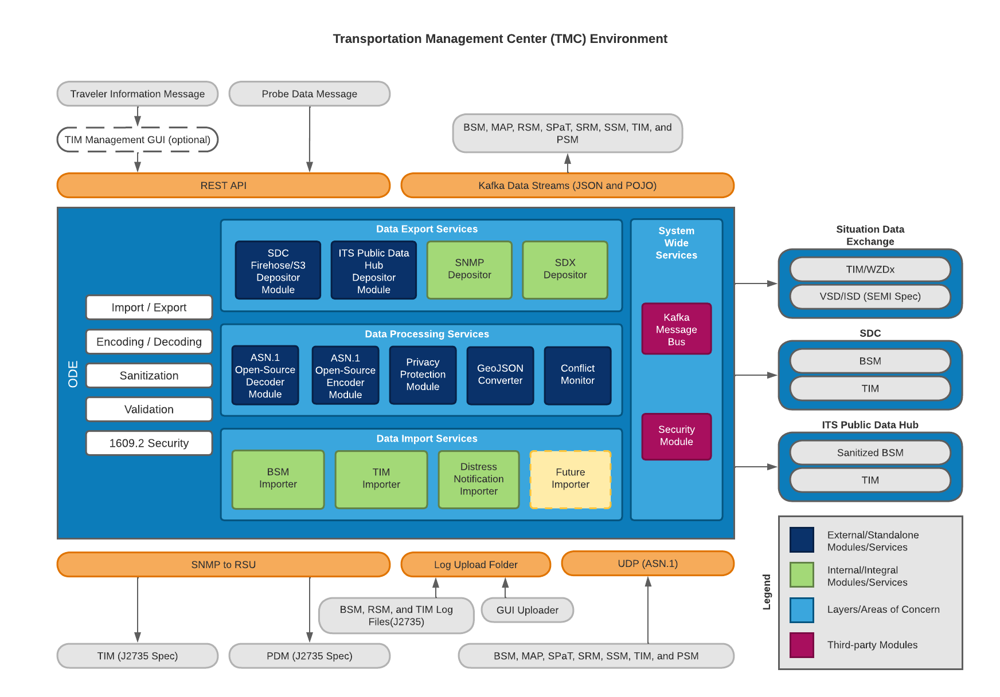
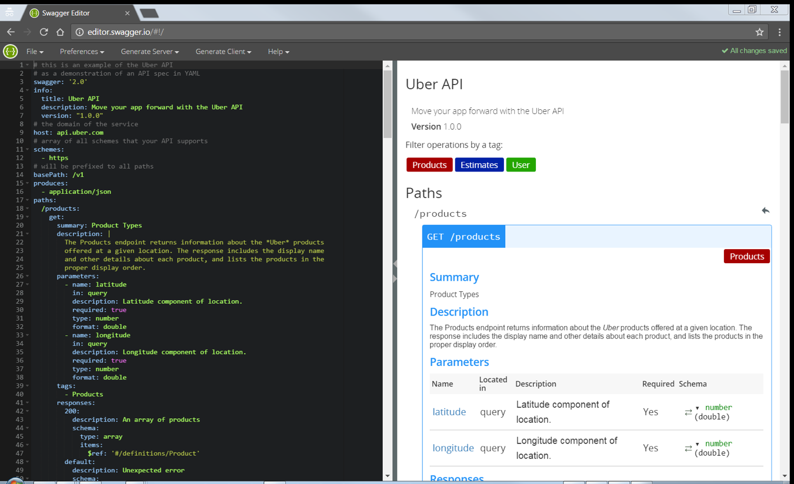

# JPO Operational Data Environment User Guide

**Submitted to**\
U.S. Department of Transportation (USDOT)\
Federal Highway Administration ITS JPO

**Prepared by**\
Booz Allen Hamilton\
8283 Greensboro Drive\
McLean, VA 22102

_Last updated April 26th, 2024_

# Table of Contents
- [JPO Operational Data Environment User Guide](#jpo-operational-data-environment-user-guide)
- [Table of Contents](#table-of-contents)
- [Version History](#version-history)
- [1 - Introduction](#1---introduction)
- [2 - Project Overview](#2---project-overview)
- [3 - System Overview](#3---system-overview)
- [4 - Audience](#4---audience)
- [5 - Glossary](#5---glossary)
- [6 - ODE Development Environment](#6---ode-development-environment)
    - [6.1 - Java Development Tools](#61---java-development-tools)
    - [6.2 - Java](#62---java)
    - [6.3 - Eclipse IDE](#63---eclipse-ide)
    - [6.4 - Maven](#64---maven)
    - [6.5 - Git Version Control](#65---git-version-control)
    - [6.6 - Building ODE Software Artifacts](#66---building-ode-software-artifacts)
      - [6.6.1 - Open-Source Repository](#661---open-source-repository)
      - [6.6.2 - ASN.1 Java API](#662---asn1-java-api)
      - [6.6.3 - Build and Deploy Procedure](#663---build-and-deploy-procedure)
      - [6.6.4 - ODE Application Properties](#664---ode-application-properties)
      - [6.6.5 - ODE Logging Properties](#665---ode-logging-properties)
- [7 - ODE Features](#7---ode-features)
    - [7.1 - Managing SNMP Devices](#71---managing-snmp-devices)
        - [7.1.1 - Query Parameters](#711---query-parameters)
        - [7.1.2 - API Details](#712---api-details)
      - [7.1.3 - Web Based View](#713---web-based-view)
      - [7.1.4 - Additional Features/ Discussion Points](#714---additional-features-discussion-points)
    - [7.2 - Logging Events](#72---logging-events)
      - [7.2.1 - Log Levels](#721---log-levels)
      - [7.2.2 - Logging setup](#722---logging-setup)
      - [7.2.3 - Steps to turn on/off logging during application runtime.](#723---steps-to-turn-onoff-logging-during-application-runtime)
    - [7.3 Inbound Data Distribution](#73-inbound-data-distribution)
      - [7.3.1 - Inbound BSM Log File Processing and Distribution](#731---inbound-bsm-log-file-processing-and-distribution)
      - [7.3.2 - Inbound TIM Log File Processing and Distribution](#732---inbound-tim-log-file-processing-and-distribution)
      - [7.3.3 Inbound Other Log File Processing and Distribution](#733-inbound-other-log-file-processing-and-distribution)
      - [7.3.4 - Inbound BSM - Text File Processing (HEX and JSON)](#734---inbound-bsm---text-file-processing-hex-and-json)
    - [7.4 - Probe Data Management](#74---probe-data-management)
      - [7.4.1 - PDM Broadcast Request Quick Start Guide](#741---pdm-broadcast-request-quick-start-guide)
    - [7.5 - Outbound TIM Broadcast](#75---outbound-tim-broadcast)
      - [7.5.1 Outbound TIM to SDX Setup](#751-outbound-tim-to-sdx-setup)
      - [7.5.2 - Outbound TIM to S3 Bucket Setup](#752---outbound-tim-to-s3-bucket-setup)
      - [7.5.3 - TIM Broadcast Request Quick Start Guide](#753---tim-broadcast-request-quick-start-guide)
    - [7.6 Privacy Protection Module (PPM)](#76-privacy-protection-module-ppm)
    - [7.7 - Data validation](#77---data-validation)
    - [7.8 - String S3 Depositor](#78---string-s3-depositor)
    - [7.9 - Security Services Module](#79---security-services-module)
- [8 - Appendix A: ODE Interface Specification](#8---appendix-a-ode-interface-specification)
    - [8.1 - File Copy Data Deposit](#81---file-copy-data-deposit)
      - [8.1.1 - Messages and Alerts](#811---messages-and-alerts)
    - [8.2 - ODE REST API](#82---ode-rest-api)
      - [8.2.1 - Upload BSM File](#821---upload-bsm-file)
      - [8.2.2 - Traveler Information Message (TIM) Interface](#822---traveler-information-message-tim-interface)
      - [8.2.3 - Probe Data Management Messages (PDM) Interface](#823---probe-data-management-messages-pdm-interface)
    - [8.3 - ODE Streaming API](#83---ode-streaming-api)
      - [8.3.1 - Direct Kafka Interface](#831---direct-kafka-interface)
      - [8.3.2 - ODE Output Schema Reference](#832---ode-output-schema-reference)
- [9 - References](#9---references)

<a name="version-history"></a>

# Version History

| Version # | Implemented By | Revision Date | What Changed?                                                                                                    |
| --------- | -------------- | ------------- | ---------------------------------------------------------------------------------------------------------------- |
| 0.1       | Hamid Musavi   |               | Initial draft                                                                                                    |
| 0.2       | Hamid Musavi   | 3/6/2017      | Updated document for ODE-146                                                                                     |
| 0.3       | ODE Team       | 3/14/2017     | Added outbound TIM documentation                                                                                 |
| 0.4       | ODE Team       | 3/28/2017     | Added PDM documentation                                                                                          |
| 0.5       | Hamid Musavi   | 5/9/207       | Added support for System Design Documentation                                                                    |
| 0.6       | ODE Team       | 5/23/2017     | Added PPM Documentation                                                                                          |
| 0.7       | ODE Team       | 5/30/2017     | Added VSD documentation                                                                                          |
| 0.8       | ODE Team       | 6/02/2017     | Added BSM documentation                                                                                          |
| 0.9       | ODE Team       | 8/28/2017     | Updated properties table. TIM/PDM REST details moved to Swagger document.                                        |
| 0.10      | ODE Team       | 9/1/2017      | Added BSM log file handling                                                                                      |
| 0.11      | ODE Team       | 10/31/2017    | Updated for open-ode                                                                                             |
| 0.12      | ODE Team       | 1/10/2018     | Updated SDC/SDW WebSockets end-point                                                                             |
| 0.13      | ODE Team       | 1/23/2018     | Documented changes related to schemaVersion 4                                                                    |
| 0.14      | ODE Team       | 2/14/2018     | Added GZIP documentation                                                                                         |
| 0.15      | ODE Team       | 12/18/2018    | Added rsuUsername and rsuPassword properties                                                                     |
| 0.16      | ODE Team       | 2/4/2019      | Removed deprecated properties. Added ode.kafkaDisabledTopics                                                     |
| 0.17      | ODE Team       | 2/6/2019      | Added SDW depositor submodule instructions. Removed deprecated properties and capabilities (VSD deposit to SDC). |

<a name="introduction"></a>

# 1 - Introduction

The JPO Operational Data Environment (ODE) product is being developed
under Agile Development Methodologies, using an open architecture
approach, in an open source environment. This document describes the
preliminary architectural design of the JPO ODE and its interfaces with
external systems including the TMC applications, field devices and
center services.

Note: This is a living document and will be updated throughout the life
of the JPO ODE project to reflect the most recent changes in the ODE
design and stakeholder feedback. All stakeholders are invited to provide
input to this document. Stakeholders may direct all input to the JPO
Product Owner at DOT, FHWA, JPO. To provide feedback, we recommend that
you create an "[issue](https://github.com/usdot-jpo-ode/jpo-ode/issues)"
in the project's GitHub repository
(<https://github.com/usdot-jpo-ode/jpo-ode/issues>). You will need a
GitHub account to create an issue. If you don't have an account, a
dialog will be presented to you to create one at no cost.

<a name="project-overview"></a>

# 2 - Project Overview

An Operational Data Environment is a real-time data acquisition and
distribution software system that processes and routes data from
Connected-X devices -- including connected vehicles (CV), personal
mobile devices, infrastructure components, and sensors -- to subscribing
applications to support the operation, maintenance, and use of the
transportation system, as well as related research and development
efforts.

The ODE is intended to complement a connected vehicle infrastructure by
brokering, processing and routing data from various data sources,
including connected vehicles, field devices, Transportation Management
Center (TMC) applications and a variety of other data users. Data users
include but not limited to transportation software applications,
Research Data Exchange (RDE), and the [Situational Data Exchange (SDX)](https://sdx.trihydro.com/).

As a data provisioning service, the ODE can provision data from
disparate data sources to software applications that have placed data
subscription requests to the ODE. On the other direction, the ODE can
accept data from CV applications and broadcast them to field devices
through Road Side Units (RSU)s and the Situational Data Exchange (SDX) which
in turn will transmit the data to Sirius XM satellites for delivery to
the connected vehicles in the field.

While provisioning data from data sources to data users, the ODE also
will perform necessary security / credential checks and, as needed, data
validation and sanitization.

-   Data validation is the process of making a judgment about the
    quality of the data and handling invalid data as prescribed by the
    system owners.

-   Data sanitization is the modification of data as originally received
    to reduce or eliminate the possibility that the data can be used to
    compromise the privacy of the individual(s) that might be linked to
    the data.

<a name="system-overview"></a>

# 3 - System Overview

JPO ODE is an open-source software application that will enable the
transfer of data between field devices and backend TMC systems for
operational, monitoring, and research purposes. The system will enable
applications to submit data through a variety standard interfaces as
illustrated in the figure below.

The mechanisms chosen for a specific deployment will depend on the
infrastructure, technical resources, and applications available to an
ODE environment.

The JPO-ODE will be designed to support the producers and consumers of
CV data as illustrated in Figure 1 below. _The implementation timeline
for the identified interfaces will depend on the needs of the JPO ODE
customers (Wyoming CV Pilot site, initially) and the priority of these
capabilities to the JPO-ODE product owner._



_Figure 1 - ODE System Data Producers and Consumers_

<a name="audience"></a>

# 4 - Audience

This document is intended for use by the ODE client applications that will be interfacing with the ODE.

<a name="glossary"></a>

# 5 - Glossary

| Term      | Description                                                                                                                                                                                                                                                                                                                                          |
| --------- | ---------------------------------------------------------------------------------------------------------------------------------------------------------------------------------------------------------------------------------------------------------------------------------------------------------------------------------------------------- |
| API       | Application Program Interface                                                                                                                                                                                                                                                                                                                        |
| ASN.1     | Abstract Syntax Notation One (ASN.1) is a standard and notation that describes rules and structures for representing, encoding, transmitting, and decoding data in telecommunications and computer networking                                                                                                                                        |
| Git       | Git is a free and open source distributed version control system designed to handle everything from small to very large projects with speed and efficiency. <https://git-scm.com>                                                                                                                                                                    |
| JDK       | Java Development Kit                                                                                                                                                                                                                                                                                                                                 |
| JPO       | Joint Program Office                                                                                                                                                                                                                                                                                                                                 |
| JRE       | Java Runtime Environment                                                                                                                                                                                                                                                                                                                             |
| JVM       | Java Virtual Machine                                                                                                                                                                                                                                                                                                                                 |
| Kafka     | Apache Kafka is publish-subscribe messaging rethought as a distributed commit log.                                                                                                                                                                                                                                                                   |
| POJO      | Plain Old Java Object                                                                                                                                                                                                                                                                                                                                |
| SAE       | SAE International is a global association of more than 128,000 engineers and related technical experts in the aerospace, automotive and commercial-vehicle industries.                                                                                                                                                                               |
| J2735     | This SAE Standard specifies a message set, and its data frames and data elements specifically for use by applications intended to utilize the 5.9 GHz Dedicated Short Range Communications for Wireless Access in Vehicular Environments (DSRC/WAVE, referenced in this document simply as “DSRC”), communications systems. (SAE International 2016) |
| SCP       | Secure Copy                                                                                                                                                                                                                                                                                                                                          |
| SDX       | Situational Data Exchange                                                                                                                                                                                                                                                                                                                             |
| SDW       | Situational Data Warehouse (the old name for the SDX)                                                                                                                                                                                                                                                                                                                             |
| TIM       | Traveler Information Message                                                                                                                                                                                                                                                                                                                         |
| US DOT    | Unites States Department of Transportation                                                                                                                                                                                                                                                                                                           |
| WebSocket | WebSocket is designed to be implemented in web browsers and web servers, but it can be used by any client or server application. The WebSocket Protocol is an independent TCP-based protocol. Its only relationship to HTTP is that its handshake is interpreted by HTTP servers as an Upgrade request.                                              |

<a name="ode-development-environment"></a>

# 6 - ODE Development Environment

<a name="java-development-tools"></a>

### 6.1 - Java Development Tools

The ODE team uses Java as the primary programming language.

Tools:

- Java
- Eclipse IDE
- Git
- Maven
- GitHub: <https://github.com/usdot-jpo-ode/jpo-ode>

<a name="java"></a>

### 6.2 - Java

Install Java Development Kit (JDK) 21

<https://www.oracle.com/java/technologies/downloads/#java21>

<a name="eclipse-ide"></a>

### 6.3 - Eclipse IDE

Download and install Eclipse.

<https://eclipse.org>

Configure Eclipse to use Java 21 JDK. Local installation of Tomcat can
integrate with Eclipse and can help with prototyping or debugging the
application.

<a name="maven"></a>

### 6.4 - Maven

Maven is a build and dependency management tool. It is recommended that
a Maven plug-in is installed with your IDE so that your IDE is Maven
"aware". Newer versions of eclipse (Luna and later versions) comes
pre-installed with a Maven plug-in.

Download and install Maven: <https://maven.apache.org/>

<a name="git-version-control"></a>

### 6.5 - Git Version Control

The ODE software is maintained and version controlled using GIT version
control system.

Recommend clients:

- Tortoise Git
- Source Tree
- GitHub Windows Desktop Application
- Git Extensions

It is recommended that GIT plug-ins are installed with your IDE so that
your IDE is Git "aware". Newer versions of eclipse (Luna and later
versions) comes pre-installed with a Git plug-in.

<a name="building-ode-software-artifacts"></a>

### 6.6 - Building ODE Software Artifacts

The ODE source code is maintained in several separate Git repositories.
Instructions for obtaining and installing the following repositories can
be found in the jpo-ode/README.md document:

| Repository     | Visibility | Description             | Source                                            |
|----------------|------------|-------------------------|---------------------------------------------------|
| jpo-ode        | public     | Main repository         | <https://github.com/usdot-jpo-ode/jpo-ode>        |
| jpo-cvdp       | public     | PII sanitization module | <https://github.com/usdot-jpo-ode/jpo-cvdp>       |
| asn1\_codec    | public     | ASN.1 encoder/decoder   | <https://github.com/usdot-jpo-ode/asn1_codec>     |
| jpo-sdw-depositor | public | SDX depositor service   | <https://github.com/usdot-jpo-ode/jpo-sdw-depositor> |
| jpo-security-svcs | public | Security services module | <https://github.com/usdot-jpo-ode/jpo-security-svcs> |
| jpo-utils | public     | Utilities for JPO repositories    | <https://github.com/usdot-jpo-ode/jpo-utils> |

<a name="open-source-repository"></a>

#### 6.6.1 - Open-Source Repository

The ODE deployment artifact consists of one or more jar files that make
up the collection of software modules and service components. Initially,
there will be only one executable jar file (one micros service) but in
the future as the ODE functionality expands it is envisioned that
additional services be introduced in separate jar files. Each service
component jar file will be a standalone "uber-jar" that contains all
necessary dependent jar files. The jar file will be deployable to a
physical or virtual server as well as within a Docker container.

The following components make up the JPO ODE software:

- jpo-ode-common: this component contains all the common classes used
  by other jpo-ode components. _This component is the lowest common
  denominator and never depends on any other jpo-ode component._

- jpo-ode-core: this component contains the core functions carried out
  by the jpo-ode.

- jpo-ode-plugins: this component contains the plug-in modules.

- jpo-ode-svcs: this component and similar future components are the
  actual service components. This component is always a Spring
  Framework application and implements a specific service.

- asn1_codec: this component is a standalone module able to
  subscribing to encoded ASN.1 messages and publishing decoded data.
  The component is also capable of encoding and publishing them to the
  ODE and other applications. This module will replace the private
  repository jpo-ode-private.

<a name="asn1-java-api"></a>

#### 6.6.2 - ASN.1 Java API

The data uploaded or deposited to the ODE from the connected vehicles
(CV) and the road-side units (RSU)s is encoded in ASN.1 format. In order
for the ODE to utilize the data, it must be able to decode the data from
ASN.1 format into a more generic format, in this case Plain Old Java
Objects (POJOs). ODE utilizes a fork of an open-source ASN.1 codec library
provided on GitHub at <https://github.com/mouse07410/asn1c> . ODE team has
built a standalone C/C++ module that uses this library to perform all
required encoding and decoding needs of the application. The module is a
submodule of ODE, also provided on GitHub:
<https://github.com/usdot-jpo-ode/asn1_codec>

<a name="build-and-deploy-procedure"></a>

#### 6.6.3 - Build and Deploy Procedure

Follow the steps in jpo-ode/README.md [Installation](../README.md#3-installation) section for building
and deploying the JPO-ODE services.

<a name="ode-application-properties"></a>

#### 6.6.4 - ODE Application Properties

JPO ODE configuration is managed through the [application.yaml](../jpo-ode-svcs/src/main/resources/application.yaml).
Many of the configuration values in the application.yaml are derived from environment variables.
It is recommended that you set these properties from your system environment variables in your .env file. 
See [sample.env](../sample.env) for examples and variable names.

See [Spring Boot's Externalized Configuration documentation](https://docs.spring.io/spring-boot/reference/features/external-config.html) 
for more information on how to use the application.yaml file and how to override the default values.

<a name="ode-logging-properties"></a>

#### 6.6.5 - ODE Logging Properties

ODE produces two log files:

1.  The application log file: for overall application health monitoring

2.  Events log file: for tracking and monitoring major data events such
    as the flow of data files through the system

The configuration of the loggers is done via _logback.xml_ file. The
default logback.xml is located in the _src/main/resources_ directory of
the source code as well as in the _BOOT-INF\\classes\\_ directory of the
executable jar file. To modify the default values, you can modify the
source _src/main/resources/logback.xml_ file before building the
software or place a different _logback.xml_ file with the modified
values in the working directory of the application.

<a name="ode-features"></a>

# 7 - ODE Features

JPO ODE provides the following features and functions to TMC
applications:

1.  Managing SNMP Devices

2.  Logging Events

3.  IEEE 1609.2 Compliance

4.  SCMS Certificate Management

5.  Inbound BSM Distribution

6.  Inbound Probe Data Distribution

7.  Outbound Probe Device Management

8.  Outbound TIM Broadcast

9.  Inbound TIM Distribution

10. Data Validation

11. Data Sanitization

<a name="managing-snmp-devices"></a>

### 7.1 - Managing SNMP Devices

Over SNMP Protocol, the ODE can ping and assess the health of an
existing Road Side Unit to ensure the system is up and running. To
trigger a specific heartbeat call, the ODE provides two separate
interfaces to deploy a message to an RSU.

<a name="query-parameters"></a>

##### 7.1.1 - Query Parameters

To make a heartbeat call, a user must provide two pieces of information
to identify the device and the information the user is attempting to
capture.

**IP Address:** The published ip address of the device.

**SNMP OID Value:** The numeric OID of the desired information.

_The OIDs for the RSUs are specified in the DSRC Roadside Unit (RSU)
Specifications Document v4.1. The units also respond to ISO standard
OIDs, as demonstrated in the screenshot below._

<a name="api-details"></a>

##### 7.1.2 - API Details

To get the results from the SNMP protocol, submit a RESTful GET request
to the route listed below.

/rsuHeartbeat?ip=\<ip\_address\>&oid=\<oid\_string\>

You should receive a detailed plain text response that looks like the
following example. If the device is off, a 4 second timeout will occur
and the ODE will indicate this with an \"\[ERROR\] Empty response\"
message. (This specific OID returns the amount of time since the device
was last powered on)

\[1.3.6.1.2.1.1.3.0 = 0:05:12.59\]

<a name="web-based-view"></a>

#### 7.1.3 - Web Based View

An additional method way to interact with the heartbeat service is
through the existing web interface located at the root of the
application. On it, a user will see a section for RSU SNMP Query and may
enter in the same IP and OID information as the API Endpoint.

<a name="additional-features-discussion-points"></a>

#### 7.1.4 - Additional Features/ Discussion Points

-   SNMP v3 discussion needed surrounding v2, v1 support

    -   V3 username/password

-   Should the responses from the application be in a standard format?
    (JSON)

<a name="logging-events"></a>

### 7.2 - Logging Events

ODE uses Logback logging framework to log application and data events.

<a name="log-levels"></a>

#### 7.2.1 - Log Levels

1.  ALL - Logger reports to all levels below

2.  DEBUG - Logger reports debug information

3.  ERROR - Logger reports error events that may still allow the
    application to continue running

4.  FATAL - Logger reports fatal errors that will cause the application
    to abort

5.  INFO - Logger reports informational messages

6.  OFF - Turns off the logger

7.  TRACE - Logger reports more specific debug information

8.  WARN - Logger reports application warnings

<a name="logging-setup"></a>

#### 7.2.2 - Logging setup

-   As it stands, the current logging framework has two separate log
    files. The first log file is for application output called ode.log.
    Application debug information and backend service messages are
    output to this file. The second log file, Events.log, contains
    informational messages pertaining to the services a message goes
    through inside of the system.

-   The current setup of the logging framework is very minimal. It
    contains four loggers and two appenders for the respective files.
    The logback framework has the ability to set time based file
    deletion, and rolling archive file naming. For the full list of
    features visit this URL: <https://logback.qos.ch/manual/>

<a name="steps-to-turn-on-off-logging-during-application-runtime"></a>

#### 7.2.3 - Steps to turn on/off logging during application runtime.

1.  Start ode and Kafka as normal.

2.  In a new terminal window run \"jconsole\".

3.  After the dialog box comes up asking for connection, click on the
    remote access button at the bottom.

4.  Input the ip address you set to be your DOCKER\_HOST\_IP:9090 (ex.
    0.0.0.0:9090).

5.  Click connect.

6.  Select insecure connection.

7.  Select the MBeans tab at the top.

8.  Expand the folder ch.qos.logback.classic until you get to Attributes
    and Operations.

9.  Open the operations Tab.

10. Select the reloadbyfilename option.

11. In the dialog box input the name of your logging configuration file.
    (Currently logback.xml)

12. Edit logback.xml inside of the docker container for ode and modifiy
    the log level for whatever logger you wish to turn off to \"OFF\".

13. Save the file and go back to the jconsole and click the button
    reloadbyfilename to submit changes.

<a name="inbound-data-distribution"></a>

### 7.3 Inbound Data Distribution

ODE accepts Inbound BSMs, TIMs and other data types via File Copy Data
Deposit mechanism as described in section 8.1. Note that after files are
processed by the ODE, they are moved to either the backup sub-directory
upon success, or the "failed" sub-directory upon error. The ODE is
capable of accepting log files in both raw data format as well as in
GZIP-compressed format. Compressed files are detected automatically and
processed in the same way as normal files, no special actions are needed
by the user.

The ODE propagates received data to applications via a subscription
service provided by Kafka messaging hub. The ODE offers two Kafka
subscription formats, JSON and serialized Java objects (also referred to
as POJO). ODE uses Kryo serializer for serializing POJOs before
publishing. See section 8.3.1 for the topic names to which applications
can subscribe.

<a name="inbound-bsm-log-file-processing-and-distribution"></a>

#### 7.3.1 - Inbound BSM Log File Processing and Distribution

1. bsmLogDuringEvent
    1. BSMs for event (10 seconds before, event, 10 seconds after all at 10 Hz) (purge first)
        1. Driver alert
        2. Received BSMs from remote vehicle(s), also record host vehicle BSMs
        3. If event is longer than 1-minute drop to 1 Hz for host and remove vehicles
        4. Add time to each record for all BSMs (from 1609.2 header)
2. bsmTx
    1. BSM once every 30 seconds (purge second)
      1. Add time to each record for all BSMs (from 1609.2 header)
3. rxMsg
    1. Received messages (purge third)
        1. Received BSMs from nearby OBUs are logged and deposited to the ODE via the file copy interface.

<a name="inbound-tim-log-file-processing-and-distribution"></a>

#### 7.3.2 - Inbound TIM Log File Processing and Distribution

1. rxMsg
    1.  Received messages (purge third)
        1.  TIMs from RSU and Satellite, message, location, method of reception (Sat/RSU) and time, only log messages within 20-mile radius and only log first time message is received
2. dnMsg
    1. DNM (purge eight)
        1. Location, time, DNM (log first unique DNM for Distressed vehicle and for each relay/received vehicle)
        2. Top priority for sending this log
3. driverAlert
    1. We have a log for driver's alerts, it will need to flag alerts that were not given because of a higher priority alert (purge ninth)
        1. Location, time, alert (FCW, TIM, not DNM)

<a name="inbound-other-log-file-processing-and-distribution"></a>

#### 7.3.3 Inbound Other Log File Processing and Distribution

**STATUS: These log messages have not yet been implemented.**

1. environmentMsg
    1. Environmental Log (purge seventh)
        1. Location, time, environmental log
            1. Second priority for sending this log
2. scms
    1. SCMS (purge fifth)
        1. Log connections to SCMS
3. systemLog
    1. System log (very PII sensitive, just for internal use and will have to be locked down and encrypted, may want to exclude collection of this once the pilot is working well) (purge sixth)
        1. Boot and shutdown location/time
        2. Application errors and re-starts
        3. OBU unique identifier
4. upgrades
    1. OBU upgrades (purge fourth)
        1. Log success/fail of firmware updates
        2. Log availability of firmware updates

<a name="inbound-bsm-text-file-processing-hex-and-json"></a>

#### 7.3.4 - Inbound BSM - Text File Processing (HEX and JSON)

HEX and JSON file processing is no longer supported

<a name="probe-data-management"></a>

### 7.4 - Probe Data Management

ODE accepts PDM messages and other metadata parameters for broadcasting
PDM messages via the REST API interface. The ODE accepts data elements
in JSON which are then sent via SNMP to an array of Roadside Units
(RSUs) which are also specified in that same JSON string.

<a name="pdm-broadcast-request-quick-start-guide"></a>

#### 7.4.1 - PDM Broadcast Request Quick Start Guide

To run a local test of the PDM message API, please follow these
instructions.

1.  Start the ODE.

2.  Reference the Swagger documentation located in the /docs folder of
    the repo to view the specifications for the API call. If needed,
    paste the YAML file into <http://editor.swagger.io> to see a rendered
    webpage for the documentation.

3.  Use a web based REST tool such as Postman to send the PDM broadcast
    request to the ODE. Make sure the REST request body contains the
    "snmp" and "rsus" elements with valid IP addresses of the RSUs that
    you intend to send the message to.

4.  The REST interface will return a response indicating the request was
    executed successfully: {success: true}. If the request fails, you
    will receive an error message such as:\

```json
{
	"timestamp": 1489415494755,
	"status": 400,
	"error": "Bad Request",
	"exception": "us.dot.its.jpo.ode.traveler.TimMessageException",
	"message": "us.dot.its.jpo.ode.traveler.TimMessageException: Empty response from RSU 127.0 .0 .1",
	"path": "/tim"
}
```

<a name="outbound-tim-broadcast"></a>

### 7.5 - Outbound TIM Broadcast

ODE accepts TIM messages and other metadata parameters for broadcasting
TIM messages via the REST API interface. The ODE accepts data elements
in JSON format from which a fully formed ASN.1 compliant J2735
TravelerInformation message will be constructed and sent to an array of
RSUs. The RSUs must be specified in the TIM broadcast message received
by the ODE. In addition to the RSU devices, the TIM message is also
deposited to the Situational Data Exchange (SDX) from which the
SiriusXM satellites will pull from and broadcast to vehicles that are
not within range of RSUs. SDX parameters are also specified in the TIM
REST interface. Please refer to the Swagger file documentation for
details of a TIM REST interface.

<a name="outbound-tim-to-sdw-setup"></a>

#### 7.5.1 Outbound TIM to SDX Setup

Traveler Information Messages may be distributed to RSUs, the SDX, or both by including certain objects in the JSON message sent to the `/tim` endpoint:

-   **RSU Distribution**: The /tim REST service will send the TIM messages to RSUs
    if both "rsus" and "snmp" elements of the request body are defined
    and valid. If either "rsus" or "snmp" are missing, the request will
    not be sent to the RSUs.

-   **SDX Enablement**: /tim REST service sends the TIM messages to SDX
    if the "sdw" element of the request body is defined and valid. If
    "sdw" element is missing, the request will not be sent to the SDX.

**SDW Depositor Submodule**

Depositing a TIM message to the Situational Data Exchange can be done
using the pre-built jpo-sdw-depositor repository. To set this service
up:

1.  Follow the steps in the ODE README.md to clone and compile the SDW
    depositor service. If you used the `--recurse-submodules` option to clone, it will automatically be cloned.

2.  Set the following environment variables in the _.env_ file:

```bash
SDW_API_KEY=myApiKey
```

3.  Follow the rest of the ODE setup steps. The SDW depositor service
    containers will be automatically created by docker-compose.

4.  Verify arrival of messages in SDX by verifying response status
    messages in the logs.

<a name="outbound-tim-to-s3-bucket-setup"></a>

#### 7.5.2 - Outbound TIM to S3 Bucket Setup

Depositing a TIM message to an S3 bucket can be done using the pre-built
jpo-s3-deposit repository. To set this service up:

1.  Follow the steps in the ODE README.md to clone and compile the S3
    deposit service.

2.  Set the following environment variables (and/or use the RDE prefixed
    variables, these prefixes are for guidance only and do not
    necessarily need to be a CVPEP or RDE bucket):

    -   CVPEP\_TIM\_S3\_ACCESS\_KEY\_ID

    -   CVPEP\_TIM\_S3\_SECRET\_ACCESS\_KEY

    -   CVPEP\_TIM\_S3\_BUCKET\_NAME

    -   CVPEP\_TIM\_S3\_DEPOSIT\_KEY

    -   CVPEP\_TIM\_S3\_TOPIC

3.  Follow the rest of the ODE setup steps. The S3 deposit service
    containers will be automatically created by docker-compose.

4.  Verify arrival of messages in S3 by visiting the AWS UI or an S3
    client application.

<a name="tim-broadcast-request-quick-start-guide"></a>

#### 7.5.3 - TIM Broadcast Request Quick Start Guide

To run a local test of the TIM Message API, please follow these
instructions:

1.  Reference the Swagger documentation located in the /docs folder of
    the repo or at <https://usdot-jpo-ode.github.io> to view the
    specifications for the API call.

2.  Copy the curl command, run the python script, or use a web based
    REST tool such as Postman to send the TIM broadcast request to the
    ODE. Make sure the REST request body contains the "snmp" and "rsus"
    elements with valid IP addresses of the RSUs that you intend to send
    the message to as well as the required SDX parameters.

3.  The REST interface will return a response indicating the deposit
    success ("success":"true") or failure ("success":"false") for each
    RSU and the SDX deposit:

<a name="privacy-protection-module-ppm"></a>

### 7.6 Privacy Protection Module (PPM)

PPM is a separate repository within the GitHub
[usdot-jpo-ode](https://github.com/usdot-jpo-ode) organization. ODE
interfaces with the PPM module via Kafka messaging hub. Please refer to
the GitHub repository <https://github.com/usdot-jpo-ode/jpo-cvdp> for
details. For instructions about configuration and integration of the PPM
with ODE, please refer to the ODE README file at the root of the GitHub
page <https://github.com/usdot-jpo-ode/jpo-ode> .

<a name="data-validation"></a>

### 7.7 - Data validation

TBD

<a name="string-s3-depositor"></a>

### 7.8 - String S3 Depositor

The ODE has the capability to deposit any string messages to any S3
buckets using the application in the jpo-s3-deposit repository. To
obtain and build this service, follow the instructions in the ODE
README.md document. Once downloaded and compiled, all the user must do
is set the relevant environment variables, the rest is managed
automatically by docker-compose.

Four example S3 deposit configurations are provided in the
docker-compose.yml file in the root of the jpo-ode directory, a BSM and
TIM depositor for both CVPEP and RDE: cvpep\_bsm\_s3dep,
rde\_bsm\_s3dep, cvpep\_tim\_s3dep, and rde\_tim\_s3dep. These example
templates are provided for convenience and guidance but may be
removed/commented out by adding a \# symbol to the front of each line,
or copied to create new a new S3 depositor.

<a name="security-services-module"></a>

### 7.9 - Security Services Module

ODE integrates with the
[jpo-security-svcs](https://github.com/usdot-jpo-ode/jpo-security-svcs)
(SEC) module for performing message signing, verification, encryption
and decryption. ODE sends TIM messages to SEC module to be signed before
broadcasting the message to RSUs and SDX. No new configuration
properties need to be set if the module and ODE run in Docker containers
on the same server. However, if they are running on different host
machines the property _ode.securitySvcsSignatureUri_ must be set to
point to the SEC domain name or IP:Port number. The SEC module must,
however, be configured with the DNS name or IP:Port of the Green Hills
HSM security service URI. This property can be defined using the
environment variable _SEC\_CRYPTO\_SERVICE\_BASE\_URI_. It must be set
to [http://ip:port](http://ip:port) of the Green Hills appliance. By default, the ODE will not sign TIMs that are delivered to RSUs. This can be changed by setting the value of the DATA_SIGNING_ENABLED_RSU environment variable found in the provided sample.env file. Additionally, signing of SDX-delivery TIMs can be configured by setting the value of the environment variable DATA_SIGNING_ENABLED_SDW found in sample.env. 

<a name="appendix-a-ode-interface-specification"></a>

# 8 - Appendix A: ODE Interface Specification

Field devices and TMC applications interface with the ODE for both
sending and receiving data to and from the ODE

Ode provides two methods of accepting data from field devices:

-   File copy: described in section 7.1

-   RESTful API: upload described in section 7.2

ODE provides several methods for the TMC applications (or any ODE client
application) to send and receive data to and from the ODE

-   RESTful API: upload described in section 7.2

-   Streaming API: described in section 7.3.

All of the above interfaces can be secured using SSL encryption.

<a name="file-copy-data-deposit"></a>

### 8.1 - File Copy Data Deposit

The File copy method is achieved by providing a configurable location on
a shared file system where field devices will be able to deposit their
data files and log files for processing. The upload location is
specified by the application properties
ode.uploadLocationRoot/ode.uploadLocationObuLog. If not specified,
default locations would be uploads/obulog sub-directory off of the
location where ODE is launched. ODE creates the specified directories if
they do not exist.

Once the ODE processes the received file, it moves it to the
"ode.uploadLocationRoot/backup" sub-directory. The backed-up file is
renamed with a timestamp in milliseconds. If the ODE fails to process a
file, it instead moves the file to the "ode.uploadLocationRoot/failed"
sub-directory.

The files copied to "ode.uploadLocationObuLog" are treated as binary
data of variable length records conforming to the specification in
"data/wydotLogRecords.h" file. No header information is expected to
precede each record. As mentioned in section 7.3, the ODE is also
capable of accepting individual files compressed with GZIP. Note that
while the ODE will automatically detect and process GZIP files, it is
not capable of importing GZIP-TAR archives containing multiple files.

| Field Name         | Field Length (bytes) | Description                                                                            |
|--------------------|----------------------|----------------------------------------------------------------------------------------|
| logRecordType     |  1                 |    Represents the type of log record as defined below: <br> typedef enum _logRecordType { <br> DN_MSG = 0, <br> ENVIRONMENT_MSG = 1, <br> DRIVER_ALERT = 2, <br> UPGRADES = 3, <br> SYSTEM_LOG = 4, <br> RX_MSG = 5, <br> SCMS = 6, <br> BSM_TX = 7, <br> BSM_RX = 8 <br> } logRecordType; |
| direction          | 1                    | Represents the source of the BSM. 0 for EV(Tx), 1 for RV(Rx)                           |
| utctimeInSec       | 4                    | UTC time in seconds from Epoc 1/1/1970                                                 |
| mSec               | 2                    | milliseconds part of UTC time                                                          |
| verificationStatus | 1                    | contains a SecurtyStatusCode as defined below:<br> typedef enum _securityResultCode { /* from dot3 */ <br> success = 0, <br> inconsistentInputParameters = 2, <br> spduParsingInvalidInput = 3, <br> spduParsingUnsupportedCriticalInformationField = 4,  <br> spduParsingCertificateNotFound = 5,  <br> spduParsingGenerationTimeNotAvailable = 6, <br> spduParsingGenerationLocationNotAvailable = 7, <br> spduCertificateChainNotEnoughInformationToConstructChain = 8,  <br> spduCertificateChainChainEndedAtUntrustedRoot = 9, <br> spduCertificateChainChainWasTooLongForImplementation = 10, <br> spduCertificateChainCertificateRevoked = 11, <br> spduCertificateChainOverdueCRL = 12, <br> spduCertificateChainInconsistentExpiryTimes = 13,  <br> spduCertificateChainInconsistentStartTimes = 14, <br> spduCertificateChainInconsistentChainPermissions = 15, <br> spduCryptoVerificationFailure = 16,  <br> spduConsistencyFutureCertificateAtGenerationTime = 17, <br> spduConsistencyExpiredCertificateAtGenerationTime = 18,  <br> spduConsistencyExpiryDateTooEarly = 19,  <br> spduConsistencyExpiryDateTooLate = 20, <br> spduConsistencyGenerationLocationOutsideValidityRegion = 21, <br> spduConsistencyNoGenerationLocation = 22,  <br> spduConsistencyUnauthorizedPSID = 23,  <br> spduInternalConsistencyExpiryTimeBeforeGenerationTime = 24,  <br> spduInternalConsistencyextDataHashDoesntMatch = 25,  <br> spduInternalConsistencynoExtDataHashProvided = 26, <br> spduInternalConsistencynoExtDataHashPresent = 27,  <br> spduLocalConsistencyPSIDsDontMatch = 28, <br> spduLocalConsistencyChainWasTooLongForSDEE = 29, <br> spduRelevanceGenerationTimeTooFarInPast = 30,  <br> spduRelevanceGenerationTimeTooFarInFuture = 31,  <br> spduRelevanceExpiryTimeInPast = 32,  <br> spduRelevanceGenerationLocationTooDistant = 33,  <br> spduRelevanceReplayedSpdu = 34,  <br> spduCertificateExpired = 35  <br> } securityResultCode;                                         |
| curLocation        | location             | The location and speed of the vehicle receiving and reporting the event.               |
|                    |                      | /* below elements units are as per SAE-2735 */ typedef struct _location {<br>uint32_t latitude;<br>uint32_t longitude;<br>uint32_t elevation;<br>uint16_t speed;<br>uint16_t heading;<br>} __attribute__((__packed__)) location; |
| rxFrom             | rxSource             | The source of the message received: typedef enum _rxSource {<br>RSU = 0,<br>SAT, //XM satelite<br>RV, /* for BSM rx */<br>SNMP /* for SRM payload from backend/ODE*/<br>} rxSource; |
| latitude           | 4                    | The latitude of the vehicle receiving and reporting the event.                         |
| longitude          | 4                    | The longitude of the vehicle receiving and reporting the event.                        |
| elevation          | 4                    | The elevation of the vehicle receiving and reporting the event.                        |
| speed              | 2                    | The speed of the vehicle receiving and reporting the event.                            |
| heading            | 2                    | The heading of the vehicle receiving and reporting the event.                          |
| length             | 2                    | Length of data contained in the following payload                                      |
| payload            | 2302                 | RAW encoded data in 1609.2 format containing a MessageFrame header plus BSM or raw BSM |

ODE will use utctimeInSec plus mSec fields to populate the generatedAt
field of the output messages if and only if the payload is not signed
with a valid signature. If the payload contains a valid 1609.2
signature, the generationTime from 1609.2 header will be used.

<a name="messages-and-alerts"></a>

#### 8.1.1 - Messages and Alerts

This interface uses the file system to copy a file from source to
destination. As a result, the messages and alerts generated by the copy
command are platform dependent. The following table describes a sample
set of exit codes returned by scp command but they may differ from the
system on which ODE is deployed and running.

Table 1 - SCP Return Codes

| 0  | Operation was successful                       |
|----|------------------------------------------------|
| 1  | General error in file copy                     |
| 2  | Destination is not directory, but it should be |
| 3  | Maximum symlink level exceeded                 |
| 4  | Connecting to host failed.                     |
| 5  | Connection broken                              |
| 6  | File does not exist                            |
| 7  | No permission to access file.                  |
| 8  | General error in sftp protocol                 |
| 9  | File transfer protocol mismatch                |
| 10 | No file matches a given criteria               |
| 65 | Host not allowed to connect                    |
| 66 | General error in ssh protocol                  |
| 67 | Key exchange failed                            |
| 68 | Reserved                                       |
| 69 | MAC error                                      |
| 70 | Compression error                              |
| 71 | Service not available                          |
| 72 | Protocol version not supported                 |
| 73 | Host key not verifiable                        |
| 74 | Connection failed                              |
| 75 | Disconnected by application                    |
| 76 | Too many connections                           |
| 77 | Authentication cancelled by user               |
| 78 | No more authentication methods available       |
| 79 | Invalid user name                              |

Table 2 - File Copy Data Deposit Messages and Alerts

| Message or Alert                                                                 | Communication Method | Description                                                                                                                                                                                                                 | Criteria                                                                                                                                                            |
|----------------------------------------------------------------------------------|----------------------|-----------------------------------------------------------------------------------------------------------------------------------------------------------------------------------------------------------------------------|---------------------------------------------------------------------------------------------------------------------------------------------------------------------|
| See Table 1 - SCP Return Codes for “copy” function Messages and Alerts           | Command exit code    | See Table 1 - SCP Return Codes for "copy" function Messages and Alerts                                                                                                                                                      | Platform Dependent                                                                                                                                                  |
| Post-copy: “IMPORTER - Failed to open or process file: {}” FileNotFoundException | Application log file | When a data file is copied into one of the ODE upload folders, ODE will try to open the file and process its content. This error message is logged when ODE fails to open the file due to file not being present.           | If the file does not exist when ODE starts to process it or for some other reason cannot be opened for reading, this message is logged in the application log file. |
| “IMPORTER - Failed to open or process file: {}” SecurityException                | Application log file | When a data file is copied into one of the ODE upload folders, ODE will try to open the file and process its content. This error message is logged when ODE fails to read the file due to lack of Java security privileges. | If a security manager exists and its checkRead method denies read access to the file, a message will be logged to the application log file.”                        |
| “IMPORTER - Failed to open or process file: {}” Error decoding data.             | Application log file | When a data file is copied into one of the ODE upload folders, ODE will try to open the file and process its content. This error message is logged when ODE fails to decode the data from ASN.1 format.                     | If the message is not encoded to the expected ASN.1 encoding, ODE will raise this error to indicate failure to decode the data.                                     |

<a name="ode-rest-api"></a>

### 8.2 - ODE REST API

ODE exposes a RESTful API for use by clients for security,
administrative and data functions. Standard HTTP/HTTPS verbs such as
GET, POST, PUT, DELETE, etc., will be deployed for various functions.

1.  host: ip:port
2.  root context path: ode/api/rest
3.  protocols:
    - http
    - https

The REST API is documented using Swagger and can be found at
<https://usdot-jpo-ode.github.io/> - this document is also located in
the repository at docs/ODESwagger.yml.



Figure 3 - ODE REST API Editor Tool

<a name="upload-bsm-file"></a>

#### 8.2.1 - Upload BSM File

ODE provides a REST API interface to upload a file to the ODE. Refer to
[ODE REST API](https://usdot-jpo-ode.github.io/) online documentation
(<https://usdot-jpo-ode.github.io>) for details.

<a name="traveler-information-message-tim-interface"></a>

#### 8.2.2 - Traveler Information Message (TIM) Interface

Refer to the
[ODESwagger.yaml](https://github.com/usdot-jpo-ode/jpo-ode/blob/develop/docs/ODESwagger.yaml)
for details of the TIM interface.

<a name="probe-data-management-messages-pdm-interface"></a>

#### 8.2.3 - Probe Data Management Messages (PDM) Interface

Refer to the
[ODESwagger.yaml](https://github.com/usdot-jpo-ode/jpo-ode/blob/develop/docs/ODESwagger.yaml)
for details of the PDM interface.

<a name="ode-streaming-api"></a>

### 8.3 - ODE Streaming API

ODE client applications will be able to subscribe to data streams via
two distinct but dependent interfaces.

1.  Clients may interface directly or through proxies with Kafka brokers
    to subscribe to a well-known topics. See section 7.3.1 for details.

2.  Clients may Interface directly with ODE through ODE provided
    WebSocket interface as defined by RFC 6455
    (<http://tools.ietf.org/html/rfc6455> ). See section 7.3.2 for
    details.

<a name="direct-kafka-interface"></a>

#### 8.3.1 - Direct Kafka Interface

To interface with Kafka directly, the client needs to know the list of
available Kafka brokers and the name of the topic that will contain the
data. The client application may use any of the following methods to
access Kafka topics:

-   Native Kafka API (C, Java, Python, etc.)

-   Kafka API RESTful Proxy such as:
    <https://www.confluent.io/blog/a-comprehensive-open-source-rest-proxy-for-kafka/>

-   Kafka API WebSocket Proxy such as:
    <https://github.com/b/kafka-websocket/blob/master/pom.xml>

A sample Java client will be available in the ODE source repository
under jpo-ode-consumer-example project.

**Kafka Publish/Subscribe Topics**

For a complete list and description of ODE publish/subscribe topics,
refer to [ODE Output Schema Reference Document](#references). (Booz
Allen Hamilton 2018)

<a name="ode-output-schema-reference"></a>

#### 8.3.2 - ODE Output Schema Reference

Full details of ODE streaming interface schemas are provided in the [ODE
Output Schema Reference Document](#references). (Booz Allen Hamilton
2018)

<a name="references"></a>

# 9 - References

- Booz Allen Hamilton. 2018. "ODE Output Schema Reference."
- SAE International. 2016. 03 30. <https://www.sae.org/standards/content/j2735_201603>
